# 01. NPU란 무엇인가 

> 담당(오너): 손보미 · 관련 세미나 주차: W1 · 상태: 검토

## 개요

NPU는 인공지능 모델의 연산을 효율적으로 처리하기 위해 설계된 **AI 가속기**입니다. 최근에는 스마트폰과 노트북, 차량, 로봇뿐 아니라 데이터센터용 서버에도 NPU가 활용되고 있습니다.

물론 NPU가 없어도 AI 모델을 실행할 수 있습니다. CPU에서도 신경망 모델을 실행할 수 있으며, GPU는 이미 AI 학습과 추론에 널리 사용되고 있습니다. 그럼에도 별도의 NPU가 등장한 이유는 AI 산업의 관심이 **모델을 학습하는 것에서, 학습된 모델을 실제 환경에서 반복적으로 실행하는 것으로 확장되었기 때문**입니다.

이 장에서는 다음 내용을 살펴봅니다.

- AI 산업에서 추론의 중요성이 커진 배경
- 신경망 연산이 전용 가속기에 적합한 이유
- CPU, GPU, TPU와 NPU의 차이
- NPU가 하나의 칩이 아니라 실행 시스템으로 동작하는 방식
- NPU의 도입 효과가 커지는 환경과 검토 조건

이 장을 읽고 나면 NPU가 왜 등장했으며, 어떤 특징을 가지고 있고, 어떤 환경에서 의미 있는 선택지가 되는지 설명할 수 있습니다.

## 배경 / 이론

### 1. NPU가 등장한 배경

#### 1.1 학습에서 추론과 서비스로

AI 모델을 활용하는 과정은 크게 **학습**과 **추론**으로 나눌 수 있습니다.

학습은 데이터를 이용해 모델의 가중치를 결정하는 과정입니다. 대규모 모델을 학습하려면 많은 GPU와 메모리, 전력과 냉각 설비가 필요합니다. 초기 AI 산업에서는 얼마나 큰 모델을 학습할 수 있는지, 얼마나 많은 연산 자원을 확보할 수 있는지가 중요한 경쟁력이었습니다.

추론은 학습이 끝난 모델을 사용해 새로운 입력에 대한 결과를 만드는 과정입니다. 이미지 분류 모델이 새로운 사진을 판별하거나, 챗봇이 사용자의 질문에 답변하고, 차량이 카메라 영상을 분석하는 작업이 모두 추론에 해당합니다.

| 구분 | 학습 | 추론 |
|---|---|---|
| 목적 | 모델의 가중치를 결정 | 학습된 모델로 결과 생성 |
| 주요 시점 | 모델 개발 단계 | 서비스 운영 단계 |
| 실행 빈도 | 상대적으로 제한적 | 사용자 요청마다 반복 |
| 주요 관심사 | 학습 시간과 확장성 | 지연시간, 처리량, 전력과 비용 |

학습에는 큰 비용이 들지만 일반적으로 일정 시점에 종료됩니다. 반면 추론은 서비스가 운영되는 동안 계속 반복됩니다.

챗봇은 질문이 들어올 때마다 답변을 생성합니다. 스마트폰은 사진을 촬영할 때마다 노이즈를 제거하거나 색상을 보정합니다. 로봇과 차량은 센서 데이터가 입력될 때마다 주변 환경을 인식하고 다음 행동을 결정합니다.

AI 산업의 관심은 이러한 변화에 따라 다음과 같이 확장되었습니다.

```text
얼마나 큰 모델을 학습할 수 있는가
                ↓
학습된 모델을 얼마나 효율적으로 반복 실행할 수 있는가
                ↓
실제 서비스 환경에서 얼마나 안정적으로 운영할 수 있는가
```

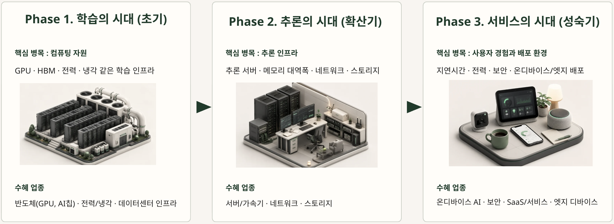

*그림 1. AI 산업의 관심은 학습 자원 확보에서 추론 효율과 실제 서비스 환경으로 확장되고 있습니다.*

이 흐름에서 NPU는 **반복되는 AI 추론을 더 효율적으로 처리하기 위한 가속기**로 등장했습니다.

#### 1.2 추론이 서비스의 성능과 비용을 결정합니다

AI 서비스에서는 모델이 실행되는 것만으로 충분하지 않습니다. 결과가 적절한 시간 안에 제공되어야 하며, 요청이 증가해도 안정적으로 동작해야 합니다.

서비스마다 중요하게 보는 조건도 다릅니다.

| 서비스 | 주요 요구 조건 |
|---|---|
| 챗봇·생성형 AI | 응답 속도, 동시 요청 처리, 토큰당 비용 |
| 스마트폰 | 배터리, 발열, 사용자 체감 속도 |
| 로봇 | 실시간 인식과 판단 |
| 차량 | 짧고 안정적인 지연시간, 안전성 |
| 엣지 서버 | 전력 대비 처리량 |
| 의료·보안 시스템 | 개인정보 보호와 로컬 처리 |

사용자가 많아질수록 동일한 모델의 추론도 수없이 반복됩니다. 추론 한 번에 필요한 시간과 전력의 차이가 작아 보여도, 전체 서비스 규모에서는 큰 운영비 차이로 이어질 수 있습니다.

따라서 서비스 단계에서는 다음 요소를 함께 고려해야 합니다.

- 요청 하나를 처리하는 데 걸리는 시간
- 일정 시간 동안 처리할 수 있는 요청의 수
- 반복 추론에 필요한 전력
- 장시간 실행할 때 발생하는 발열
- 모델과 데이터를 저장하기 위한 메모리
- 서버와 네트워크 사용 비용
- 실제 배포 환경의 제약

NPU는 이러한 반복 추론에서 발생하는 지연시간과 전력 소비, 운영 비용을 줄이는 것을 목표로 합니다.

> NPU의 가치는 한 번의 거대한 계산보다, 동일하거나 유사한 신경망 연산이 지속적으로 반복되는 환경에서 커집니다.

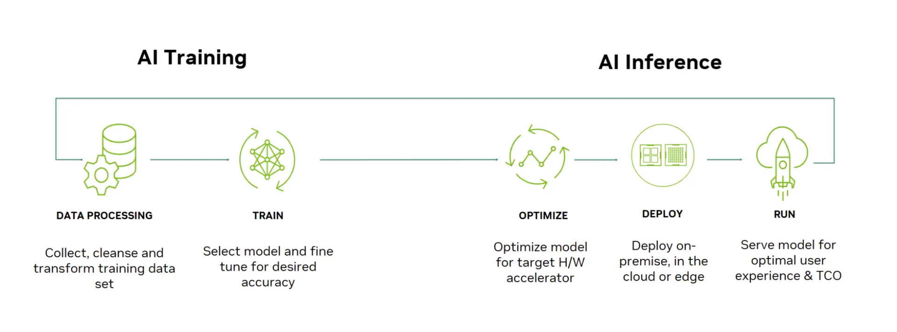

*그림 2. 서비스 종류에 따라 추론에서 중요하게 보는 조건은 달라집니다.*

### 2. AI 연산은 무엇이 다른가

NPU가 필요한 이유를 이해하려면 AI 모델이 어떤 방식으로 계산되는지 살펴봐야 합니다.

일반적인 프로그램은 조건문과 분기, 파일 입출력, 사용자 입력, 예외 처리와 시스템 제어처럼 다양한 작업을 수행합니다. 실행 상황에 따라 다음에 처리할 명령도 계속 달라질 수 있습니다.

반면 신경망 모델에서는 비교적 규칙적인 수치 연산이 여러 계층에 걸쳐 반복됩니다.

대표적인 연산은 다음과 같습니다.

- 행렬곱
- 벡터 연산
- 합성곱
- 활성화 함수
- 정규화
- Attention

AI 모델마다 구조는 다르지만, 많은 입력값과 가중치를 곱하고 더하는 연산이 반복된다는 공통점이 있습니다.

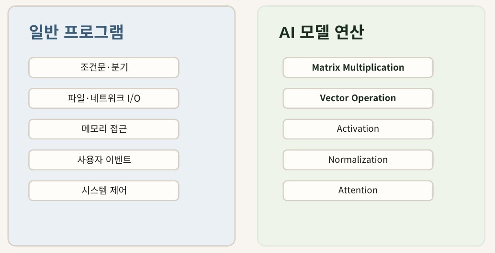

*그림 3. 일반 프로그램은 다양한 제어 흐름을 처리하고, AI 모델은 규칙적인 수치 연산을 반복합니다.*

#### 2.1 반복성과 병렬성

신경망 연산의 대표적인 특징은 **반복성**과 **병렬성**입니다.

**반복성**

같은 종류의 곱셈과 덧셈이 모델의 여러 계층에서 반복됩니다.

이미지 모델에서는 합성곱과 행렬 연산이 여러 위치에서 반복되고, Transformer에서는 Attention과 MLP를 구성하는 행렬 연산이 여러 계층에 걸쳐 반복됩니다.

**병렬성**

서로 영향을 주지 않는 여러 계산은 동시에 처리할 수 있습니다.

행렬의 각 원소를 계산하는 작업 가운데 상당수는 여러 연산 유닛에 나누어 실행할 수 있습니다. 동일한 형태의 연산이 대량으로 반복되기 때문에, 전용 하드웨어를 사용하면 많은 계산을 동시에 처리할 수 있습니다.

> AI 모델의 반복성과 병렬성은 신경망 연산을 전용 가속기로 처리할 수 있게 만드는 핵심 특성입니다.

#### 2.2 작은 연산이 대규모 행렬 연산으로 확장됩니다

신경망 연산의 기본 단위 가운데 하나는 **MAC(Multiply-Accumulate)**입니다. MAC은 입력값과 가중치를 곱하고, 그 결과를 누적해서 더하는 연산을 의미합니다.

하나의 뉴런에서는 여러 입력값에 각각 가중치를 곱한 뒤 그 결과를 더해 출력을 만듭니다. 이러한 계산이 여러 개 모이면 벡터 연산이 되고, 계층 전체로 확장되면 행렬이나 텐서 연산으로 표현할 수 있습니다.

```text
곱셈과 누적
    ↓
벡터 연산
    ↓
행렬 연산
    ↓
신경망 계층
```

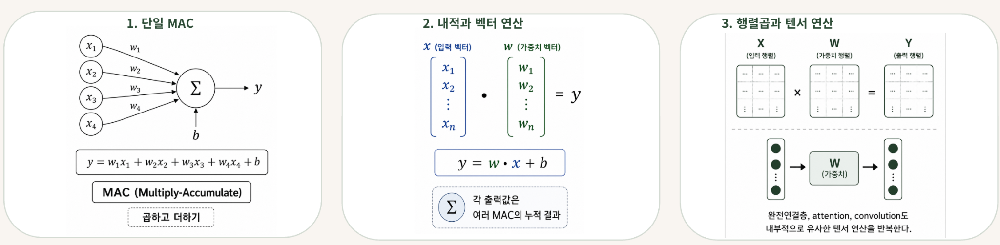

*그림 4. 작은 곱셈·누적 연산은 벡터와 행렬, 텐서 연산으로 확장됩니다.*

NPU는 이처럼 반복적이고 병렬 처리가 가능한 연산을 효율적으로 수행하도록 설계됩니다.

다만 모든 연산에서 NPU가 유리한 것은 아닙니다. 조건 분기가 많거나 실행 흐름이 계속 달라지는 작업은 CPU가 더 적합할 수 있습니다. NPU의 강점은 신경망에서 자주 나타나는 규칙적인 연산 패턴에서 드러납니다.

### 3. 계산 속도만 높이면 충분할까

AI 모델의 실행 성능은 연산 장치의 속도만으로 결정되지 않습니다.

신경망을 계산하려면 모델의 가중치와 입력 데이터를 메모리에서 가져와야 합니다. 한 계층에서 만들어진 중간 결과는 다음 계층의 입력으로 사용되며, 필요에 따라 다시 저장하거나 불러와야 합니다.

모델을 실행하는 동안에는 다음과 같은 데이터가 계속 오갑니다.

- 모델 가중치
- 입력 데이터
- 계층별 중간 결과
- 최종 출력 데이터

연산 장치가 아무리 빨라도 필요한 데이터가 도착하지 않으면 계산을 이어 갈 수 없습니다. 빠른 작업자가 있어도 작업에 필요한 재료가 제때 공급되지 않으면 전체 생산 속도가 높아지지 않는 것과 같습니다.

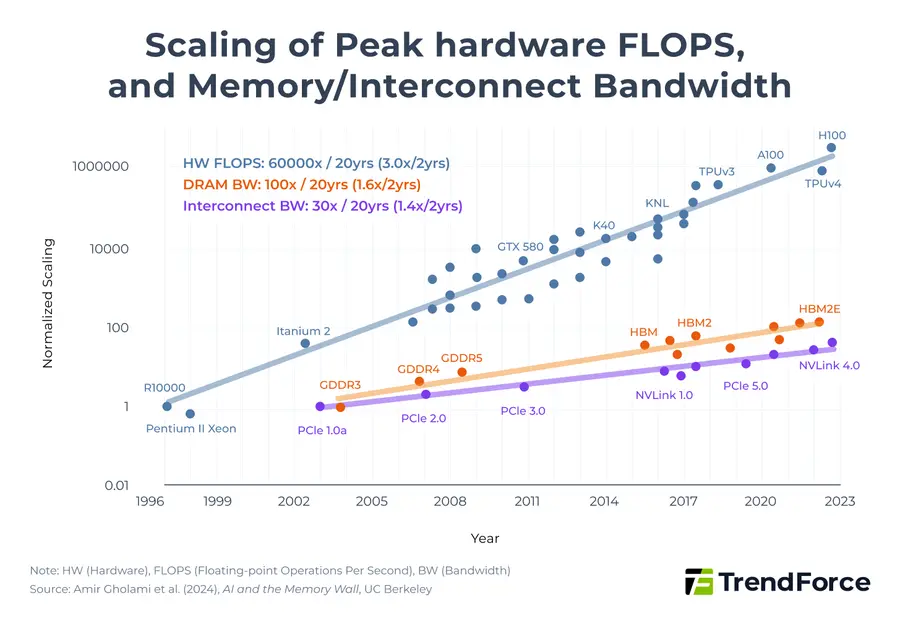

*그림 5. AI 가속기에서는 연산 능력뿐 아니라 데이터를 공급하는 속도도 중요합니다.*

이처럼 연산 능력에 비해 데이터를 공급하는 속도가 성능을 제한하는 현상을 흔히 **메모리 병목**이라고 합니다. 컴퓨터 구조에서는 이를 Memory Wall이라는 용어로도 설명합니다.

이 장에서는 세부 구조보다 다음 사실만 기억하면 충분합니다.

> AI 가속기의 성능은 얼마나 많이 계산할 수 있는지뿐 아니라, 계산에 필요한 데이터를 얼마나 효율적으로 공급할 수 있는지에 따라 달라집니다.

#### 3.1 데이터 이동을 줄이고 재사용을 늘립니다

NPU에서는 단순히 계산을 빠르게 수행하는 것만 중요한 것이 아닙니다. 계산에 필요한 데이터를 **외부 메모리에서 얼마나 자주 가져와야 하는지**도 성능에 영향을 줍니다.

신경망 연산에서는 같은 가중치나 입력값이 여러 계산에 반복해서 사용되는 경우가 많습니다. 이때 필요한 데이터를 계산할 때마다 외부 메모리에서 다시 읽어 오면 시간이 더 걸리고 전력도 더 많이 소모됩니다.

그래서 NPU는 한 번 가져온 데이터를 내부 메모리에 잠시 저장해 두고, 여러 연산에서 반복해서 활용합니다. 이를 통해 외부 메모리와의 왕복을 줄이고, 연산 유닛이 데이터를 기다리는 시간도 줄일 수 있습니다.

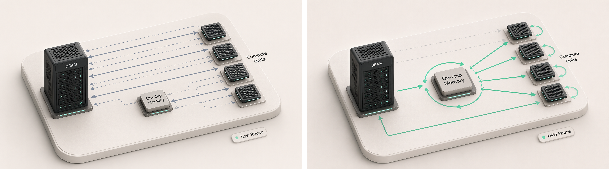

*그림 6. 왼쪽은 외부 메모리와 연산 유닛 사이의 왕복이 잦은 구조를, 오른쪽은 온칩 메모리를 중심으로 데이터를 재사용하는 구조를 단순화해 보여줍니다.*

이 그림은 실제 NPU 내부 구조를 그대로 표현한 것이 아니라, 데이터 재사용의 방향을 이해하기 위한 개념도입니다.

NPU의 효율은 단순히 얼마나 많은 계산을 수행하느냐보다, **가져온 데이터를 얼마나 효과적으로 재사용하느냐**와도 깊은 관련이 있습니다.

구체적인 메모리 계층과 데이터 흐름은 뒤의 「NPU 메모리 계층과 데이터 재사용」 장에서 자세히 다룹니다.

### 4. NPU의 정의와 주요 특징

NPU는 **Neural Processing Unit**의 약자로, 신경망 연산을 효율적으로 처리하기 위해 설계된 AI 가속기입니다.

조금 더 구체적으로 말하면 다음과 같습니다.

> NPU는 신경망에서 반복되는 행렬·벡터 연산을 효율적으로 처리하고, 데이터 이동과 전력 소비를 줄이는 것을 목표로 설계된 AI 가속기입니다.

NPU는 모든 종류의 프로그램을 처리하기 위한 범용 프로세서가 아닙니다. 신경망에서 자주 나타나는 연산 패턴에 하드웨어 자원을 집중하는 대신, 해당 연산에서 높은 처리량과 전력 효율을 얻는 방향으로 설계됩니다.

#### 4.1 신경망 연산에 특화되어 있습니다

NPU는 행렬곱, 벡터 연산, 합성곱 등 신경망에서 자주 사용되는 연산을 효율적으로 처리하도록 설계됩니다.

다양한 명령을 모두 처리하기보다, 반복적으로 사용되는 AI 연산에 더 많은 하드웨어 자원을 배치합니다.

#### 4.2 반복 연산을 병렬로 처리합니다

신경망에서는 비슷한 형태의 계산이 대규모로 반복됩니다.

NPU는 여러 연산 유닛을 활용해 이러한 계산을 동시에 수행합니다. 이를 통해 같은 시간에 더 많은 신경망 연산을 처리할 수 있습니다.

#### 4.3 데이터 이동을 함께 최적화합니다

NPU는 연산 속도만 높이는 것이 아니라, 연산에 필요한 데이터를 효율적으로 공급하는 구조를 함께 고려합니다.

자주 사용하는 데이터를 내부에 보관하고 재사용하면 외부 메모리와의 데이터 이동을 줄일 수 있습니다.

#### 4.4 전력 효율을 중요하게 고려합니다

신경망 연산에 필요한 기능에 하드웨어 자원을 집중하면 동일한 추론을 더 적은 전력으로 처리할 가능성이 커집니다.

이 특성은 스마트폰, 차량, 로봇과 같이 전력과 발열이 제한된 환경에서 특히 중요합니다.

#### 4.5 NPU는 하나의 고정된 구조가 아닙니다

NPU라는 이름이 하나의 표준화된 하드웨어 구조를 의미하는 것은 아닙니다.

제품과 제조사에 따라 다음 요소가 달라질 수 있습니다.

- 지원하는 신경망 연산
- 지원하는 수치 정밀도
- 내부 메모리 구성
- 목표로 하는 모델과 서비스
- 컴파일러와 개발 도구
- 모바일·차량·서버 등 적용 환경

스마트폰용 NPU는 낮은 전력과 발열을 중요하게 고려할 수 있고, 데이터센터용 NPU는 많은 사용자 요청을 동시에 처리하는 데 초점을 맞출 수 있습니다.

따라서 NPU는 하나의 동일한 제품군이라기보다, **신경망 연산에 특화된 여러 종류의 AI 가속기를 포괄하는 개념**으로 이해하는 것이 적절합니다.

### 5. CPU, GPU, TPU와 NPU는 어떻게 다른가

AI 연산에는 여러 종류의 프로세서가 사용됩니다. CPU, GPU, TPU와 NPU는 모두 AI 모델을 실행할 수 있지만, 설계 목적과 강점을 두는 지점이 다릅니다.

이 네 장치를 단순한 성능 순서로 이해해서는 안 됩니다. 범용성이 높은 장치는 다양한 작업을 처리할 수 있고, 특화된 장치는 특정 연산에서 더 높은 효율을 얻을 수 있습니다.

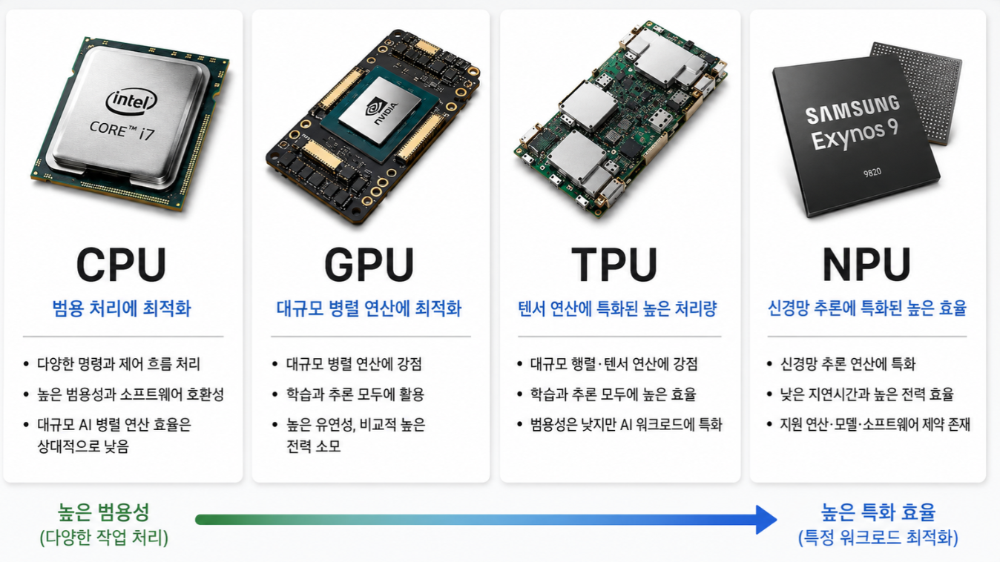

*그림 7. CPU, GPU, TPU와 NPU는 설계 목적과 특화 수준이 서로 다릅니다.*

#### 5.1 CPU

CPU는 다양한 명령과 제어 흐름을 처리하는 범용 프로세서입니다.

운영체제를 실행하고, 입출력과 예외 상황을 관리하며, 조건 분기가 많은 프로그램을 처리하는 데 적합합니다. AI 시스템에서도 데이터 전처리와 후처리, 서비스 제어와 전체 실행 관리에 사용됩니다.

**주요 특징**

- 다양한 종류의 프로그램을 실행할 수 있습니다.
- 조건 분기와 복잡한 제어 흐름에 강합니다.
- 소프트웨어 호환성과 범용성이 높습니다.
- 대규모 병렬 연산에서는 효율이 낮을 수 있습니다.

#### 5.2 GPU

GPU는 많은 연산을 동시에 처리하도록 설계된 병렬 프로세서입니다.

그래픽 처리를 위해 발전했지만, 행렬과 벡터 연산을 병렬로 처리하는 능력이 딥러닝 학습과 추론에도 적합했습니다. 현재는 AI 연구와 모델 학습, 범용 추론에서 널리 사용됩니다.

**주요 특징**

- 대규모 병렬 연산에 강합니다.
- AI 학습과 추론에 모두 활용됩니다.
- 다양한 모델과 연산을 비교적 유연하게 지원합니다.
- 높은 성능을 위해 많은 전력과 냉각 자원이 필요할 수 있습니다.

#### 5.3 TPU

TPU는 **Tensor Processing Unit**의 약자로, Google이 텐서 연산을 효율적으로 처리하기 위해 개발한 AI 가속기 계열입니다.

대규모 행렬과 텐서 연산에 특화되어 있으며, 학습과 추론 모두에 활용됩니다. 특히 Google의 소프트웨어와 클라우드 환경을 중심으로 사용됩니다.

**주요 특징**

- 대규모 행렬·텐서 연산에 특화되어 있습니다.
- 학습과 추론 모두에서 높은 처리량을 목표로 합니다.
- Google의 소프트웨어와 클라우드 생태계와 밀접하게 연결되어 있습니다.
- 범용 프로세서라기보다 AI 연산 특화 가속기에 해당합니다.

> TPU는 일반적인 프로세서 분류라기보다 Google이 개발한 특정 AI 가속기 계열의 명칭입니다. 따라서 NPU와 완전히 대립되는 상위 범주라기보다, AI 전용 가속기의 대표적인 구현 사례로 이해하는 것이 적절합니다.

#### 5.4 NPU

NPU는 신경망 연산을 효율적으로 처리하도록 설계된 AI 가속기를 가리킵니다.

반복적인 행렬·벡터 연산과 신경망 추론에 하드웨어 자원을 집중하며, 스마트폰과 노트북, 차량, 로봇, 데이터센터 등 다양한 환경에서 사용됩니다.

**주요 특징**

- 신경망 추론에 사용되는 연산에 특화되어 있습니다.
- 낮은 지연시간과 높은 전력 효율을 목표로 합니다.
- 엣지와 온디바이스 환경에서도 널리 활용됩니다.
- 지원 모델과 연산, 소프트웨어 환경에 제약이 있을 수 있습니다.

#### 5.5 네 가지 프로세서 비교

| 구분 | CPU | GPU | TPU | NPU |
|---|---|---|---|---|
| 주요 목적 | 범용 계산과 시스템 제어 | 대규모 병렬 계산 | 텐서 연산 가속 | 신경망 연산 가속 |
| 범용성 | 매우 높음 | 높음 | 상대적으로 낮음 | 상대적으로 낮음 |
| 주요 활용 | 운영체제, 전후처리, 제어 | AI 학습과 범용 추론 | 대규모 학습과 추론 | 반복 추론, 엣지·온디바이스 |
| 주요 강점 | 유연성과 호환성 | 높은 병렬 성능과 넓은 생태계 | 높은 텐서 처리량 | 전력 효율과 낮은 지연시간 |
| 고려 사항 | 대규모 AI 연산 효율 | 전력과 시스템 비용 | 특정 생태계 의존성 | 모델·연산·SDK 지원 범위 |

CPU, GPU, TPU와 NPU는 서로를 완전히 대체하는 관계가 아닙니다. 실제 AI 시스템에서는 CPU가 전체 실행을 관리하고, GPU나 NPU가 특정 연산을 담당하는 방식으로 함께 사용될 수 있습니다.

> 중요한 질문은 어떤 프로세서가 절대적으로 우수한지가 아니라, 실행하려는 워크로드에 어떤 프로세서가 가장 적합한가입니다.

### 6. NPU는 칩 하나로 동작하지 않습니다

AI 모델을 NPU에서 실행하려면 하드웨어뿐 아니라 모델을 변환하고 실행하는 소프트웨어가 필요합니다.

PyTorch나 ONNX로 만든 모델이 그대로 NPU에서 실행되는 것은 아닙니다. 먼저 모델의 연산 구조를 분석하고, NPU가 처리할 수 있는 형태로 변환해야 합니다. 이후 실행 순서와 메모리 사용 방식을 정한 뒤 NPU에서 추론을 수행합니다.

전체 흐름을 단순화하면 다음과 같습니다.

```text
AI 모델
   ↓
모델 변환과 최적화
   ↓
실행 관리
   ↓
NPU 하드웨어
   ↓
추론 결과
```

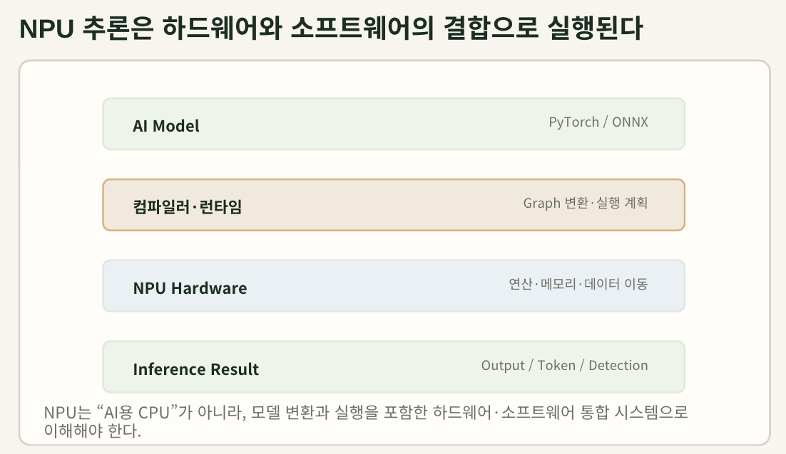

*그림 8. NPU 추론은 모델, 소프트웨어 스택과 하드웨어가 함께 작동할 때 실행됩니다.*

각 구성 요소의 역할은 다음과 같습니다.

| 구성 요소 | 역할 |
|---|---|
| AI 모델 | 학습된 모델 구조와 가중치를 제공합니다. |
| 컴파일러 | 모델을 NPU가 실행할 수 있는 형태로 변환합니다. |
| 런타임 | 모델의 실행 순서와 장치 사용을 관리합니다. |
| 드라이버 | 운영체제와 NPU 사이에서 명령을 전달합니다. |
| NPU 하드웨어 | 실제 신경망 연산과 데이터 처리를 수행합니다. |

모델에 NPU가 지원하지 않는 연산이 포함되어 있으면 일부 연산을 CPU나 GPU에서 대신 처리해야 할 수 있습니다. 이 경우 장치 사이의 데이터 이동이 추가되어 기대한 성능이 나오지 않을 수도 있습니다.

따라서 NPU는 단순한 반도체 칩이라기보다, **모델·컴파일러·런타임·하드웨어가 결합된 실행 시스템**으로 이해하는 편이 적절합니다.

컴파일러의 최적화와 NPU 내부 구성 요소는 뒤의 아키텍처와 모델 컴파일 장에서 자세히 다룹니다.

### 7. NPU의 가치가 커지는 환경

AI 추론은 실행되는 위치에 따라 **클라우드 AI**, **엣지 AI**, **온디바이스 AI**로 구분할 수 있습니다.

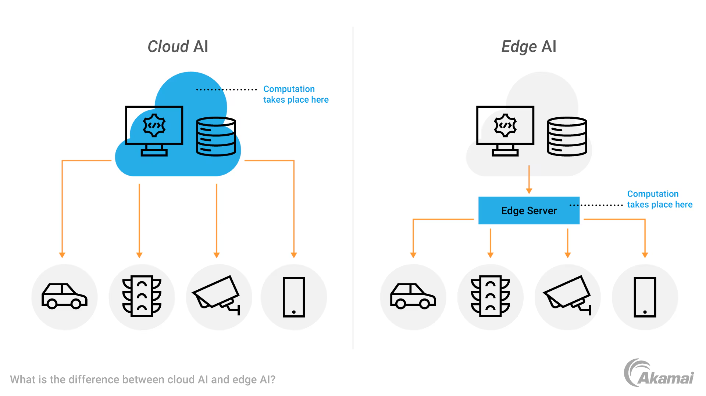

*그림 9. AI 추론은 데이터센터, 현장과 가까운 엣지 서버, 사용자 기기 내부에서 실행될 수 있습니다.*

#### 7.1 클라우드 AI

클라우드 AI는 데이터를 원격 데이터센터로 보내고, 서버에서 추론한 결과를 다시 받는 방식입니다.

강력한 연산 자원을 사용할 수 있고 모델을 중앙에서 관리하기 쉽지만, 네트워크 왕복 시간이 발생하고 데이터를 외부로 전송해야 합니다.

#### 7.2 엣지 AI

엣지 AI는 사용자나 데이터가 만들어지는 현장과 가까운 서버에서 추론하는 방식입니다.

공장 내부 서버, 병원과 매장의 로컬 서버, 통신사의 엣지 인프라 등이 여기에 해당합니다.

#### 7.3 온디바이스 AI

온디바이스 AI는 스마트폰, 노트북, 카메라, 차량과 로봇처럼 최종 기기 내부에서 직접 추론하는 방식입니다.

```text
클라우드 데이터센터
        ↓
현장과 가까운 엣지 서버
        ↓
사용자 기기 내부
```

NPU는 특히 엣지와 온디바이스 환경에서 다음과 같은 가치를 제공할 수 있습니다.

**빠른 응답**

원격 서버와 통신하지 않고 가까운 위치에서 추론하면 네트워크 왕복 시간을 줄일 수 있습니다.

**낮은 전력과 발열**

스마트폰과 로봇처럼 배터리와 냉각 능력이 제한된 장치에서는 높은 최고 성능보다 전력 효율이 중요합니다.

**네트워크 독립성**

네트워크 연결이 불안정하거나 끊긴 환경에서도 기능을 유지할 수 있습니다.

**개인정보 보호**

얼굴, 음성, 위치와 의료 데이터처럼 민감한 정보를 기기 밖으로 보내지 않고 처리할 수 있습니다.

**운영 비용 절감**

반복적인 클라우드 요청을 줄이면 서버와 네트워크 사용 비용을 낮출 수 있습니다.

다만 모든 모델을 기기 내부에서 실행하는 것이 항상 효율적인 것은 아닙니다. 모델이 매우 크거나 자주 업데이트해야 하는 경우에는 클라우드 환경이 더 적합할 수 있습니다.

### 8. NPU는 언제 선택해야 하는가

NPU는 모든 AI 서비스에 필요한 장치는 아닙니다.

다음 조건이 여러 개 겹칠 때 NPU의 도입 효과가 커질 수 있습니다.

#### NPU가 적합할 가능성이 높은 조건

- 같은 모델을 반복적으로 실행합니다.
- 응답 시간이 짧아야 합니다.
- 전력과 발열에 제한이 있습니다.
- 엣지 또는 온디바이스에서 실행해야 합니다.
- 네트워크 연결 없이도 동작해야 합니다.
- 민감한 데이터를 외부로 보내기 어렵습니다.
- 모델의 주요 연산을 NPU가 지원합니다.

#### 도입 전에 확인해야 할 조건

- 모델에 필요한 주요 연산을 지원합니까?
- 모델과 중간 데이터를 저장할 메모리가 충분합니까?
- 모델을 안정적으로 변환할 수 있습니까?
- CPU나 GPU에서 대신 실행되는 연산은 없습니까?
- 기존 환경보다 실제 지연시간과 전력이 개선됩니까?
- 개발과 유지보수 비용을 포함해도 이점이 있습니까?

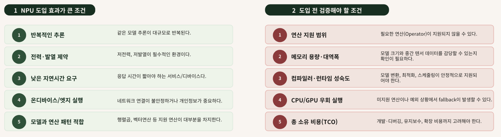

*그림 10. NPU 도입은 최고 성능보다 실제 워크로드와 실행 환경의 적합성을 먼저 확인해야 합니다.*

NPU를 선택할 때는 제품 설명에 표시된 최고 성능 수치만으로 판단해서는 안 됩니다. 실제로 실행하려는 모델과 입력 조건에서 지연시간, 처리량, 전력과 비용을 비교해야 합니다.

> NPU 도입은 칩의 성능 순위를 고르는 일이 아니라, 실제 워크로드와 실행 환경의 적합성을 확인하는 과정입니다.

### 9. Transformer와 LLM 추론에서의 NPU

Transformer 기반 언어 모델은 문장을 한 번에 완성하지 않습니다.

사용자의 입력을 처리한 뒤 다음 토큰을 하나 생성하고, 생성한 토큰을 다시 문맥에 추가하여 다음 토큰을 계산합니다. 이 과정은 답변이 완성될 때까지 반복됩니다.

```text
사용자 입력
    ↓
문맥 처리
    ↓
다음 토큰 계산
    ↓
토큰 하나 생성
    ↓
다음 토큰 계산 반복
```

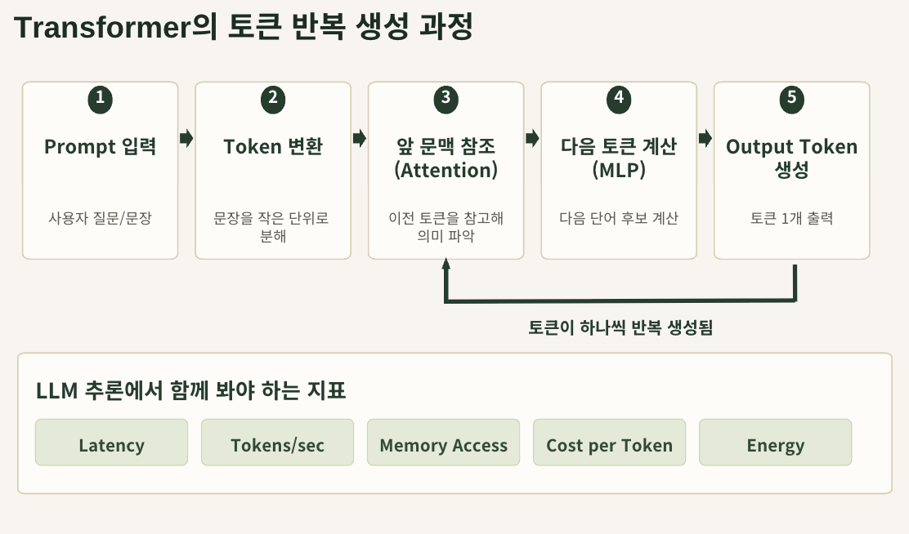

*그림 11. Transformer 기반 언어 모델은 이전 문맥을 참고해 토큰을 하나씩 반복 생성합니다.*

출력 문장이 길어지거나 사용자가 많아질수록 연산과 메모리 사용량도 계속 증가합니다. 따라서 LLM 서비스에서는 다음 요소를 함께 고려해야 합니다.

- 첫 번째 응답이 시작되기까지의 시간
- 토큰이 연속적으로 생성되는 속도
- 동시에 처리할 수 있는 사용자 수
- 모델과 문맥을 저장하는 데 필요한 메모리
- 토큰을 생성하는 데 필요한 전력과 비용

LLM용 추론 가속기의 목적은 가장 높은 순간 성능을 내는 데만 있지 않습니다. 사용자가 체감하는 응답 속도를 유지하면서 더 많은 요청을 안정적으로 처리하고, 토큰당 전력과 비용을 낮추는 것이 중요합니다.

이 장에서는 LLM 추론의 반복 구조가 NPU와 같은 추론 가속기의 필요성을 높인다는 점까지만 살펴봅니다. Transformer의 구조와 세부 추론 지표는 뒤의 LLM과 vLLM 장에서 자세히 다룹니다.

### 10. 정리

NPU는 신경망에서 반복되는 행렬과 벡터 연산을 효율적으로 처리하도록 설계된 AI 가속기입니다.

NPU가 등장한 배경에는 AI 산업이 모델 학습에서 실제 서비스와 반복 추론으로 확장된 변화가 있습니다. 모델이 서비스에 배포되면 동일한 연산이 사용자 요청마다 반복되며, 지연시간과 전력, 운영 비용도 함께 누적됩니다.

AI 모델에는 반복성과 병렬성이 높은 연산이 많습니다. NPU는 이러한 연산을 동시에 처리하고, 필요한 데이터를 내부에서 재사용함으로써 외부 메모리와의 데이터 이동을 줄이는 방향으로 설계됩니다.

NPU는 단순한 반도체 칩 하나가 아닙니다. 실제 실행에는 모델 변환, 컴파일러, 런타임, 드라이버와 하드웨어가 함께 필요합니다. 모델과 소프트웨어가 NPU의 지원 범위에 맞지 않으면 기대한 성능이 나오지 않을 수도 있습니다.

따라서 NPU를 선택할 때는 다음 질문을 먼저 살펴봐야 합니다.

> 어떤 AI 모델을, 어디에서, 어느 정도의 지연시간·전력·비용으로 반복 실행하려고 합니까?

NPU는 반복 추론이 많고, 낮은 지연시간과 전력 효율이 중요하며, 모델의 연산 구조가 하드웨어에 적합할 때 효과적인 선택지가 될 수 있습니다.

다음 장에서는 GPU와 NPU의 구조적 차이를 살펴봅니다. GPU의 유연한 병렬 처리 방식과 NPU의 특화된 연산·데이터 흐름이 실제 AI 워크로드에서 어떤 차이를 만드는지 비교합니다.

## 참고

- John L. Hennessy and David A. Patterson, *Computer Architecture: A Quantitative Approach*, 6th Edition, 2019.
- Vivienne Sze et al., “Efficient Processing of Deep Neural Networks: A Tutorial and Survey,” *Proceedings of the IEEE*, 2017.
- Norman P. Jouppi et al., “In-Datacenter Performance Analysis of a Tensor Processing Unit,” *ISCA*, 2017.
- Yu-Hsin Chen et al., “Eyeriss: An Energy-Efficient Reconfigurable Accelerator for Deep Convolutional Neural Networks,” *IEEE JSSC*, 2017.
- Ashish Vaswani et al., “Attention Is All You Need,” *NeurIPS*, 2017.
