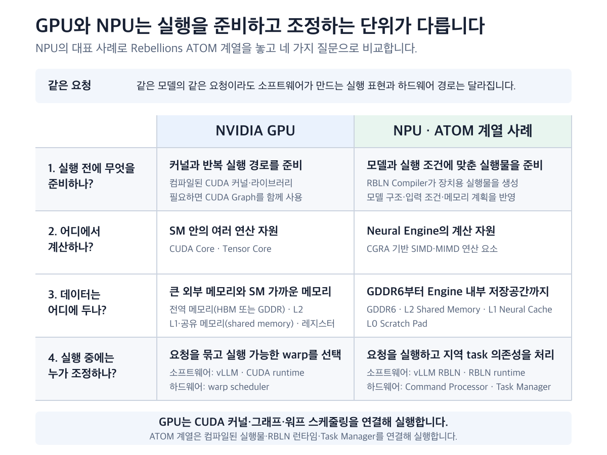
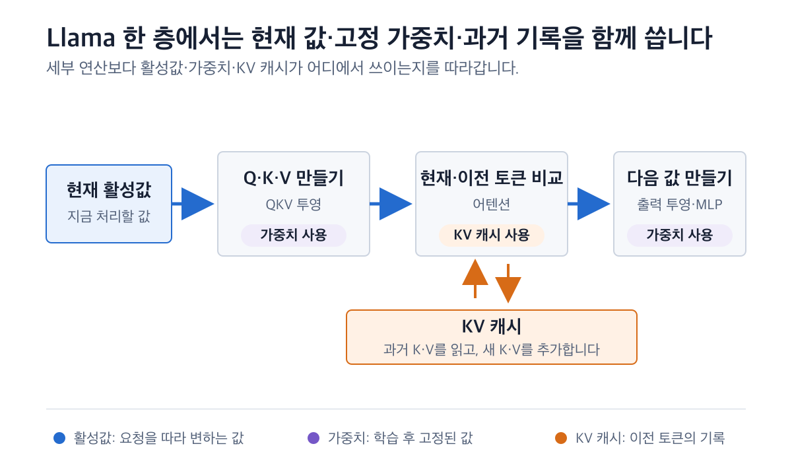
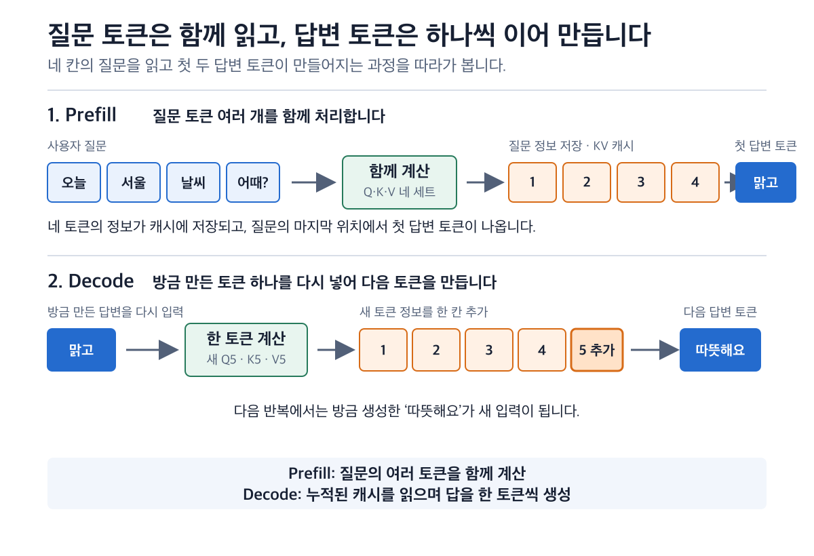
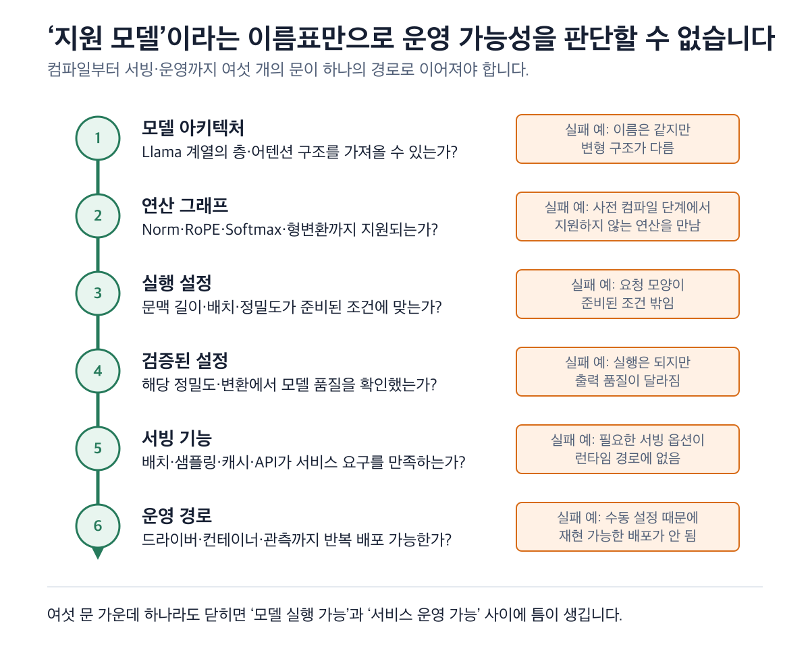

# 02. GPU vs NPU — 무엇이 다른가

## 개요

GPU와 NPU의 차이를 묻는 가장 익숙한 답은 `GPU는 범용, NPU는 AI 전용`입니다.
방향은 맞지만 지금의 가속기를 설명하기에는 부족합니다. GPU에도 행렬곱을 빠르게
처리하는 Tensor Core가 있고, 낮은 정밀도의 계산, 연산 융합, 가까운 메모리에서의
데이터 재사용을 적극적으로 씁니다. GPU도 이미 AI에 깊이 특화돼 있습니다.

그렇다면 별도의 NPU를 검토하는 이유는 어디에 있을까요? 답은 행렬 연산기의 유무보다
넓은 곳에 있습니다. 같은 AI 작업을 잘게 나누는 방식, 가중치와 중간 결과를 공급하는
경로, 실행 순서를 준비하고 조정하는 범위, 모델을 서빙과 운영까지 잇는 소프트웨어가
함께 실제 성능을 만듭니다.

물류센터의 분류기가 아무리 빨라도 화물이 늦게 도착하거나 다음 공정이 막히면 전체
배송은 빨라지지 않습니다. 가속기도 마찬가지입니다. 연산기가 낼 수 있는 최대 성능은
출발점이고, 데이터 공급과 모델 지원, 서빙 조건을 통과한 뒤에야 사용자가 체감하는
지연시간과 처리량이 됩니다.

이 장에서는 다음 세 단계를 따라 GPU와 NPU를 비교합니다.

```text
하드웨어 잠재력 → 소프트웨어가 실현한 성능 → 운영 가치
```

먼저 GPU를 가장 강한 형태로 살펴봅니다. 이어서 같은 선형층의 행렬곱을 GPU와 대표
NPU 실행 경로에 각각 올려, 일을 나누고 데이터를 공급하며 실행을 조정하는 과정을
비교합니다. 그 뒤 Llama 3 8B의 한 층을 사례로 삼아 시야를 모델 전체로 넓힙니다.
Llama는 이 글의 주제가 아니라, 행렬곱 하나의 효율과 모델 전체의 효율이 왜 다른지를
확인하는 중간 사례입니다.

NPU의 구체적인 사례로는 Rebellions ATOM 계열과 RBLN 소프트웨어 경로를 사용합니다.
여기서 ATOM은 NPU를 설명하는 대표 사례로만 둡니다. 공개된 구조와 소프트웨어
문서가 하드웨어부터 운영까지 한 경로로 이어져 있어, 일반 원리를 실제 사례에
대입하기 좋기 때문입니다.

이 장을 읽고 나면 다음 질문에 답할 수 있어야 합니다.

1. GPU도 행렬곱을 잘하는데 왜 NPU를 따로 검토합니까?
2. 같은 행렬곱을 실행할 때 일을 나누고 데이터를 공급하는 방식은 어떻게 다릅니까?
3. 하드웨어의 최대 성능이 실제 모델 속도와 전력 효율로 이어지지 않는 지점은
   어디입니까?
4. 사양, 통제된 모델 측정과 배포 검증은 각각 무엇을 증명합니까?
5. 행렬곱 하나가 아니라 모델 전체 실행 경로를 봐야 하는 이유는 무엇입니까?
6. GPU와 NPU의 소프트웨어·운영 경로를 어떤 공통 질문으로 비교합니까?
7. 어떤 조건에서 NPU를 검토할 이유가 커지며, 실제 우위는 어떻게 확인합니까?

## 배경 / 이론

### 1. 사양표의 숫자가 서비스 성능이 되기까지

가속기 사양에는 FLOPS와 TOPS가 자주 등장합니다. 두 값은 장치가 1초 동안 처리할
수 있는 연산 수를 나타냅니다.

- FLOPS(Floating-Point Operations Per Second)는 FP32, FP16, FP8 같은
  부동소수점 연산 처리량을 나타낼 때 주로 씁니다. 10 TFLOPS는 표시된 조건에서
  초당 10조 회의 부동소수점 연산이라는 뜻입니다.
- TOPS(Tera Operations Per Second)는 초당 조 단위 연산량입니다. AI 가속기에서는
  INT8이나 INT4 같은 정수·저정밀 연산 성능을 표시할 때 자주 씁니다.

숫자를 비교하려면 데이터 정밀도, 곱셈과 덧셈을 세는 방법, 희소성 가정부터 맞춰야
합니다. INT8 100 TOPS와 FP16 100 TFLOPS는 같은 숫자처럼 보여도 같은 계산 조건이
아닙니다. FLOPS와 TOPS는 계산부의 최대 처리량을 보여 줍니다. 사용자가 보는 초당
토큰 수와 응답시간은 데이터 공급, 모델 지원과 요청 조건까지 반영한 결과입니다.

최대 연산량이 실제 가치가 되려면 세 층을 통과해야 합니다.

| 층 | 무엇을 확인합니까? | 잠재력이 줄어드는 지점 |
| --- | --- | --- |
| 하드웨어 잠재력 | 연산기, 정밀도, 메모리 용량·대역폭, 데이터 이동 경로 | 데이터가 늦게 도착하거나 연산기를 충분히 채우지 못합니다. |
| 소프트웨어가 실현한 성능 | 그래프 변환, 컴파일·융합, 지원 연산, 메모리·실행 계획 | 모델 일부가 최적 경로에서 끊기거나 추가 이동이 생깁니다. |
| 운영 가치 | 첫 토큰 시간(TTFT), 이후 토큰 간 시간(TPOT), 처리량, 전력, 배포와 관측 | 요청 형태와 동시 사용자, CPU·서버 메모리와 가속기 사이의 통신, 운영 비용이 결과를 바꿉니다. |

데이터 이동은 첫 번째 손실 지점을 이해하는 단서입니다. 2016년 Eyeriss 연구는
상용 65nm 공정의 16비트 고정소수점 CNN 가속기를 분석하면서, 곱셈-누산(MAC) 한
번의 에너지를 기준으로 메모리 계층 접근 비용을 비교했습니다. 연산 셀 안의
레지스터 파일 접근은 1, 이웃 연산 셀 사이 전달은 2, 칩 안 전역 버퍼 접근은 6,
외부 DRAM 접근은 200이었습니다.

이 값은 현재 GPU나 ATOM의 지연시간 또는 전력 실측값이 아닙니다. 특정 공정과
가속기를 분석한 역사적 상대값입니다. 다만 같은 데이터를 먼 곳에서 계속 가져오기보다
가까운 곳에 두고 재사용해야 하는 이유는 분명하게 보여 줍니다. GPU와 NPU가 모두
캐시, SRAM, 레지스터나 scratchpad 같은 저장공간을 두고 계산과 이동을 겹치려는
이유도 여기에 있습니다.

사양표는 장치의 잠재력을 알려 줍니다. 특정 모델을 조건에 맞춰 측정하면 그 잠재력이
얼마나 실현됐는지 볼 수 있습니다. 실제 서비스에 배포한 뒤에는 지연 목표, 장시간
안정성, 서버 전체 전력과 운영 가능성을 확인할 수 있습니다. 이 세 증거는 서로 다른
질문에 답합니다.

| 증거 수준 | 답하는 질문 | 함께 적어야 할 조건 |
| --- | --- | --- |
| 제품 사양 | 장치가 낼 수 있는 잠재력은 무엇입니까? | 정밀도, 일반 밀집 연산(dense)·희소 연산(sparse), 연산 산정법, 메모리 용량·대역폭 |
| 통제된 모델 측정 | 고정한 모델과 부하에서 얼마나 실현됩니까? | 모델 품질, 입력·출력 길이, 동시 요청, 장치 수, 소프트웨어 버전 |
| 배포 검증 | 필요한 서비스에서 계속 사용할 수 있습니까? | TTFT·TPOT·처리량, 안정성, 카드·서버 전력, 배포·관측 경로 |

> Eyeriss의 `1·2·6·200`은 Chen et al., ISCA 2016, p.8 Table IV의 상대
> 에너지 값입니다. 접근 시간의 배수나 현행 제품의 성능 배수가 아닙니다.

### 2. GPU도 유연성과 특화를 함께 갖추고 있습니다

GPU의 강점은 다양한 모델과 연산을 소프트웨어로 표현하면서 반복되는 큰 행렬곱은
특화된 연산기로 빠르게 처리하는 데 있습니다.

NVIDIA GPU는 작업을 많은 스레드(thread)에 나눕니다. 스레드 32개가 워프(warp)를
이루고 같은 커널 코드를 SIMT 방식으로 실행합니다. 여러 워프를 Streaming
Multiprocessor(SM)가 관리합니다. 어떤 워프가 메모리를 기다리면 워프 스케줄러는
실행할 준비가 된 다른 워프를 고를 수 있습니다. 행렬곱에서는 Tensor Core가 타일
단위의 묶음 연산을 맡고, 레지스터·공유 메모리·캐시는 자주 쓰는 데이터를 계산부
가까이에 둡니다.

소프트웨어도 이 하드웨어를 전제로 발전했습니다. PyTorch가 표현한 모델을 GPU에서
특정 계산을 수행하는 CUDA 커널과 라이브러리에 연결하고, cuBLAS와 TensorRT-LLM은
행렬곱·융합·저정밀 경로를 고릅니다. vLLM 같은 서빙 엔진은 여러 요청과 KV 캐시를
관리합니다. CUDA Graph는
반복되는 커널 호출을 미리 묶어 두었다가 다시 실행해 CPU의 호출 비용을 줄입니다.
GPU Operator와 DCGM은 Kubernetes 배포와 관측 경로를 잇습니다.

GPU도 실행 전에 많은 일을 준비합니다. 컴파일한 여러 커널과 그래프 가운데 실제
입력과 요청 상태에 맞는 경로를 런타임에서 고르고, 칩 안에서는 스케줄러가 준비된
작업을 계속 배치합니다. 준비와 실행 중 선택이 함께 작동하는 유연성은 모델 구조와
입력 모양이 자주 바뀌는 환경에서 특히 강합니다.

특화 가속기는 반복되는 계산과 데이터 흐름을 더 넓은 범위에서 구조와 컴파일러에
담아 왔습니다. Google TPU v1의 시스톨릭 배열은 역사적으로 이 생각을 알기 쉽게
보여 준 사례입니다. 256×256의 8비트 MAC 배열에 입력과 부분합을 규칙적으로 흘려
큰 행렬곱을 처리했습니다. NPU의 구현은 하나로 고정되지 않으며 ATOM은 다른 선택을
보여 줍니다.

Rebellions ATOM은 공식 자료에서 CGRA(Coarse-Grained Reconfigurable Array)
기반 구조로 소개됩니다. 여러 연산 블록의 연결과 역할을 비교적 굵은 단위로
재구성해 신경망의 계산 흐름에 맞추려는 구조입니다. 공개된 ATOM 계열 자료에는
Neural Engine, Scratch Pad, Neural Cache, Shared SRAM, GDDR6, Command Processor와
Task Manager가 나옵니다. 구체적인 블록 내부 동작은 후속 아키텍처 장의 주제이고,
여기서는 이 요소들이 컴파일된 작업과 데이터 이동을 실행하는 전체 경로에 포함된다는
점까지만 봅니다.

GPU와 NPU 모두 컴파일과 실행 중 제어를 사용합니다. 비교할 것은 결정의 시점과
범위입니다. 어떤 결정을 어느 단계에서 내리고, 그 결정을 얼마나 넓게 재사용하며,
어떤 하드웨어가 실행하는지를 함께 봐야 합니다.

### 3. 같은 GEMM도 실행을 조직하는 방식은 다릅니다

장치 구조의 차이를 보려면 먼저 수학을 같게 고정해야 합니다. 신경망의 선형층은
대개 다음과 같은 일반 행렬곱(GEMM)으로 나타낼 수 있습니다.

```text
Y = XW + b
```

`X`는 입력 활성값, `W`는 가중치, `b`는 편향, `Y`는 다음 연산으로 넘어갈
결과입니다. 같은 행렬 크기와 데이터 정밀도, 같은 실행 묶음(batch) 조건을 두
장치에 넣었다고 가정하겠습니다. 양쪽 모두 해야 할 일은 같습니다.

1. 큰 행렬을 계산 자원에 맞는 작은 타일로 나눕니다.
2. 입력과 가중치 타일을 계산부 가까이 가져옵니다.
3. 곱셈과 누산을 병렬로 실행합니다.
4. 부분합과 중간 결과를 가까운 저장공간에서 재사용합니다.
5. 완성한 결과를 다음 연산에 넘깁니다.

GPU 경로에서는 라이브러리와 컴파일러가 장치와 입력 조건에 맞는 커널을 고릅니다.
커널은 행렬을 타일로 나누고, 외부 메모리의 데이터를 L2 캐시와 공유 메모리,
레지스터로 옮기며 Tensor Core에 일을 배치합니다. 실행 중에는 런타임과 워프
스케줄러가 준비된 작업을 선택합니다. 다음 연산과 합칠 수 있다면 커널 융합으로
중간 결과의 저장과 재호출을 줄입니다.

RBLN 경로에서는 컴파일러가 모델 그래프와 입력 조건을 보고 연산 융합, 분할과
묶기, 타일링, 실행 순서, 버퍼 구성과 메모리 할당을 계획합니다. 결과물인 `.rbln`
파일에는 컴파일된 그래프, NPU 프로그램, 명령 흐름, 미리 계산한 텐서 메모리 배치와
가중치가 들어갑니다. 런타임이 이 실행물을 불러와 입력을 옮기고 명령 버퍼를
제출하면, 칩 안의 Command Processor와 Task Manager가 의존성이 풀린 지역 작업과
데이터 이동을 조정합니다.

| 공통 질문 | NVIDIA GPU | 대표 NPU·ATOM 계열 사례 |
| --- | --- | --- |
| 실행 전에 무엇을 준비합니까? | 커널·라이브러리와 필요한 CUDA Graph | 모델·입력 조건을 반영한 NPU 실행물 |
| 일을 어떻게 나눕니까? | 커널의 타일, 스레드·워프와 SM | 컴파일러가 정한 타일·지역 작업과 Neural Engine |
| 데이터는 어디에 둡니까? | 외부 메모리, L2, 공유 메모리와 레지스터 | GDDR6, Shared SRAM, Neural Cache와 Scratch Pad |
| 실행 중 누가 조정합니까? | 런타임, 워프 스케줄러와 SM | 런타임, Command Processor와 Task Manager |
| 조건이 달라지면 어떻게 합니까? | 넓은 커널·입력 조합에서 경로를 선택합니다. | 지원 조건과 준비한 실행물 범위에서 경로를 선택합니다. |



*GPU는 CUDA 커널·그래프와 워프 스케줄링을 연결합니다. NPU의 한 사례인 ATOM
계열은 컴파일된 실행물·RBLN 런타임·Task Manager를 연결합니다.*

두 경로의 차이는 실행 결정을 담는 범위와 그 결정을 실행하는 장치에서 드러납니다.
반복되는 모델과 입력 조건을 더 넓게 계획하면 같은 실행·메모리 배치를 여러 번
재사용하기 좋습니다. 반면 지원 범위 밖의 연산이나 모양을 만나면 다시 컴파일하거나
다른 경로가 필요할 수 있습니다. GPU는 더 넓은 변화에 대응할 실행 선택지를 축적해
왔고, NPU는 지원 경로 안의 반복 작업에서 실행과 데이터 이동을 더 촘촘하게
맞추려 합니다.

데이터 공급이 늦으면 어떤 구조에서도 연산기가 기다립니다. 기다리는 시간이 늘면
실제 이용률이 떨어지고 지연시간과 처리량, 에너지 효율에 영향을 줍니다. GPU는 많은
워프와 캐시·공유 메모리, 커널 융합으로 이 시간을 줄이거나 숨깁니다. NPU는 컴파일한
실행 순서와 온칩 저장공간, 데이터 이동 계획으로 같은 문제를 줄이려 합니다. 어느
방식이 더 유리한지는 행렬 크기, 반복성, 지원 범위와 실제 부하가 결정합니다.

### 4. 행렬곱 하나에서 모델 전체로 넓혀 봅니다

GEMM 하나의 가속 비율이 모델 전체에 그대로 이어지지는 않습니다. 실제 신경망에서는
큰 행렬곱 사이에 정규화, 활성화 함수, 텐서 모양 변경, 캐시 읽기와 다음 층으로의
데이터 이동이 이어집니다. 이 연결이 끊기면 빠른 행렬 연산기가 만든 이득도
줄어듭니다.

여기서 대표 사례로 Llama 3 8B의 한 디코더 층을 보겠습니다. LLM 가운데 Llama를
고른 이유는 NVIDIA GPU와 vLLM에서 널리 다뤄지고 RBLN SDK에도 공식 실행 안내가
있으며, 공식 참조 구현에서 한 층의 연산과 KV 캐시 경로를 확인할 수 있기 때문입니다.
Llama의 세부 구조를 배우려는 것이 아니라, 한 모델 안에서 서로 다른 연산과 데이터가
어떻게 이어지는지 확인하려는 선택입니다.

Llama의 Transformer 층은 입력값을 정규화한 뒤 Q·K·V를 만들고, 어텐션 결과와
MLP 결과를 차례로 더해 다음 층으로 넘깁니다. Q·K·V 투영, 출력 투영과 MLP 투영은
큰 행렬곱입니다. 그 사이에는 RMSNorm, RoPE, Softmax와 SiLU처럼 행렬곱과 성격이
다른 연산이 들어갑니다.

한 층에서는 수명과 쓰임이 다른 세 종류의 데이터가 움직입니다.

| 데이터 | 무엇입니까? | 언제 필요합니까? |
| --- | --- | --- |
| 가중치 | 학습을 마친 모델의 파라미터 | 각 층의 투영과 MLP를 계산할 때 읽습니다. |
| 활성값 | 현재 요청이 만드는 중간 결과 | 한 연산의 출력에서 다음 연산의 입력으로 이어집니다. |
| KV 캐시 | 이미 처리한 토큰의 K와 V | 입력을 읽을 때 만들고 다음 토큰을 생성할 때 다시 읽습니다. |

가중치는 모델에 고정돼 있고, 활성값은 계산을 지나며 계속 바뀝니다. KV 캐시는
요청마다 생기며 문맥이 길어질수록 커집니다. 세 데이터를 모두 `메모리 사용량`으로
묶어 버리면 무엇을 가까이 두고 어떤 이동을 줄여야 하는지 알기 어렵습니다.



*Llama 한 층에는 고정된 가중치, 요청마다 변하는 활성값, 요청의 과거를 저장한
KV 캐시가 함께 움직입니다.*

모델이 실제 경로에 오르려면 여러 조건을 통과해야 합니다. 모델 클래스를 가져올 수
있어도 필요한 정밀도나 입력 모양이 지원되지 않을 수 있습니다. 컴파일은 성공했지만
일부 연산 사이에서 그래프가 끊기거나 추가 데이터 이동이 생길 수도 있습니다. 서빙
엔진의 배치와 KV 캐시 설정이 실행물의 조건과 맞지 않을 수도 있습니다.

NPU의 구조적 이점은 큰 행렬곱뿐 아니라 주변 연산과 데이터 이동이 지원 경로 안에서
이어질 때 실제 모델 성능으로 나타납니다. GPU도 같은 모델 전체 경로를 최적화하지만,
더 넓은 연산과 입력 변화에 대응하는 유연성을 중요한 설계 목표로 둡니다. 한
연산기의 최고 성능이 아니라 모델 전체가 어떤 경로로 이어지는지를 비교해야 하는
이유입니다.

### 5. Prefill과 Decode는 워크로드가 장치와 만나는 사례입니다

같은 Llama 요청 안에서도 입력을 읽을 때와 답을 이어 쓸 때 일의 모양이 달라집니다.
사용자의 프롬프트를 처음 처리하는 구간을 Prefill이라고 합니다. 여러 입력 토큰의
Q·K·V를 계산하고 K와 V를 KV 캐시에 저장하며 첫 출력 토큰을 준비합니다. 첫 토큰이
나온 뒤에는 Decode를 반복합니다. 새 토큰 하나의 Q·K·V를 계산하고, 새 K와 V를
캐시에 더한 뒤 지금까지 쌓인 K와 V를 조회해 다음 토큰을 만듭니다.



*Prefill은 입력 토큰 여러 개를 함께 처리해 KV 캐시를 만들고, Decode는 새 토큰을
입력해 캐시를 한 칸 늘리며 다음 토큰을 만듭니다.*

Prefill은 여러 토큰을 함께 처리하므로 큰 행렬곱을 만들기 쉽습니다. 이때는 계산
자원을 충분히 채울 수 있는지, 첫 토큰이 나오기까지 걸리는 시간(TTFT)과 입력 토큰
처리량이 중요합니다. Decode에서는 한 요청이 새 토큰을 하나씩 만듭니다. 각 단계의
새 계산은 작지만 모델 가중치와 누적된 KV 캐시는 계속 필요합니다. 첫 토큰 이후
토큰 사이 평균 시간(TPOT), 사용자별 출력 속도, 전체 출력 처리량과 메모리 용량을
함께 봐야 합니다.

한 요청의 Decode는 토큰 하나씩 진행되지만 서버의 Decode batch는 1보다 클 수
있습니다. 서빙 엔진이 여러 사용자의 새 토큰을 한 실행 묶음으로 모으기 때문입니다.
요청을 더 많이 묶으면 가중치를 여러 토큰 계산에 활용하고 연산기를 채우기
쉬워지지만, 사용자 대기시간과 KV 캐시 사용량도 달라집니다.

GPU 경로에서는 vLLM이 요청을 묶고 조건에 맞는 CUDA 커널이나 CUDA Graph를
고릅니다. RBLN 경로에서는 Prefill과 Decode 조건을 반영한 실행물을 준비하고,
설정에 따라 여러 Decode 배치 크기를 컴파일해 현재 요청 수를 담는 후보를 런타임에서
고를 수 있습니다. 예를 들어 `1·4·8`을 준비했다면 활성 요청이 3개일 때 배치 4
실행물을 선택할 수 있습니다. 이 숫자는 공식 동적 배치 문서의 설정 예시이지
성능값이나 모든 RBLN 실행의 기본값이 아닙니다.

#### 계산 모양을 조금 더 깊이 보면

토큰 수를 `T`라고 두면 Prefill의 각 Q는 최대 `T`개의 K와 비교합니다. 모든 토큰의
관계를 묶으면 head마다 `T×T` 모양의 어텐션 점수를 계산하는 셈입니다. Decode는
새 Q 하나가 현재 토큰까지 포함한 `T`개의 K를 조회하므로 `1×T` 모양이 됩니다.
이는 Q와 K의 비교 관계를 나타낸 논리적인 모양입니다. FlashAttention처럼 전체
점수표를 메모리에 만들지 않고 같은 결과를 계산하는 구현도 있습니다.

```text
Prefill: 여러 Q × 여러 K → head마다 T×T
Decode:  새 Q 하나 × 현재까지의 K → head마다 1×T
```

Llama 3는 여러 Q head가 더 적은 K/V head를 나누어 쓰는
Grouped-Query Attention(GQA)을 사용합니다. Q head 수를 `Hq`, K/V head 수를
`Hkv`, head 하나의 차원을 `Dh`라고 쓰면 Prefill의 Q는 `T×Hq×Dh`, K와 V는
각각 `T×Hkv×Dh`입니다. `Hkv`를 `Hq`보다 작게 두면 K와 V를 Q만큼 모두
보관하지 않아도 되므로 KV 캐시의 크기와 읽기 양을 줄일 수 있습니다.

Prefill과 Decode는 요청의 모양이 달라지면 같은 장치의 이용률과 병목, 관찰할 지표도
달라진다는 워크로드 사례입니다. 그래서 장치 비교에서는 `Llama를 실행했다`에서
멈추지 않고 입력 길이, 출력 길이, 동시 요청과 문맥 증가를 함께 고정해야 합니다.

### 6. 하드웨어 잠재력은 소프트웨어와 운영 경로를 지나야 합니다

모델 전체를 장치의 실행으로 바꾸는 일은 컴파일러와 런타임, 서빙 엔진이 나눠
맡습니다. NVIDIA와 RBLN에 서로 다른 잣대를 적용하기보다 같은 계층에서 같은
질문을 묻는 편이 정확합니다.

| 계층 | 공통 질문 | NVIDIA GPU 사례 | RBLN NPU 사례 |
| --- | --- | --- | --- |
| 모델 연결 | 어떤 모델 클래스와 체크포인트를 가져옵니까? | PyTorch·Transformers | Optimum RBLN·Transformers |
| 최적화·컴파일 | 어떤 연산·정밀도·입력 모양을 융합하고 실행 코드로 바꿉니까? | CUDA, cuBLAS, TensorRT-LLM | RBLN Compiler |
| 런타임 | 준비한 실행 경로와 실제 입력을 어떻게 연결합니까? | CUDA Runtime·CUDA Graph | RBLN Runtime·`.rbln` |
| 서빙 | 배치, KV 캐시와 요청 스케줄링을 어떻게 처리합니까? | vLLM·TensorRT-LLM | vLLM RBLN |
| 운영·관측 | 장치를 어떻게 배포하고 상태를 확인합니까? | GPU Operator·DCGM | NPU Operator·Metrics Exporter |

이 표에서는 기능의 개수보다 필요한 모델과 설정이 각 계층을 실제로 통과하는지를
확인합니다. NVIDIA 경로는 오랫동안 많은 모델과 도구, 운영 경험이 축적돼 있다는
강점이 있습니다. RBLN도 컴파일러와 런타임, vLLM, Kubernetes NPU Operator와
Metrics Exporter를 연결합니다. 경로가 존재한다는 사실과 지원 범위·제약·운영
성숙도가 같다는 말은 다릅니다.

모델 지원은 다음 질문을 차례로 통과해야 합니다.

1. 해당 모델 클래스와 체크포인트를 가져올 수 있습니까?
2. 필요한 연산, 정밀도와 입력 모양을 지원합니까?
3. 목표 문맥 길이, batch, 어텐션 방식과 장치 수를 설정할 수 있습니까?
4. 같은 조건을 다룬 공식 예제나 검증 기록이 있습니까?
5. 필요한 서빙 기능과 API가 동작합니까?
6. 컨테이너, Kubernetes, 지표 수집과 장애 진단이 이어집니까?



*모델 지원은 하나의 체크 표시가 아니라 모델 연결부터 운영까지 이어지는 경로입니다.*

지원되지 않는 연산을 만났을 때의 동작도 실행 경로에 따라 다릅니다. AOT
(Ahead-of-Time) 컴파일은 실행 전에 모델 그래프를 NPU 실행물로 바꾸므로, 필요한
연산이나 입력 조건을 처리하지 못하면 컴파일 단계에서 문제가 드러날 수 있습니다.
RBLN PyTorch eager 경로에서는 공식 지원 목록 밖의 일부 PyTorch 연산이 CPU에서
실행될 수 있습니다. 모델 지원을 평가할 때는 사용한 실행 경로와 실패 위치를 함께
기록해야 성능 영향을 해석할 수 있습니다.

운영 가치는 가속기 카드와 그 바깥의 실행을 함께 봐야 합니다. 서빙 엔진이 실제 요청을
어떻게 묶는지, CPU·서버 메모리와 가속기 사이의 통신과 장치 간 이동이 얼마나
생기는지, 활용률과 메모리·전력을 관찰할 수 있는지까지 확인합니다. RBLN Metrics
Exporter의 `rbln_npu_power`는 카드
전력 지표입니다. CPU, 메모리, 팬과 네트워크까지 포함한 서버 전체 효율을 비교하려면
같은 경계의 콘센트 전력을 별도로 측정해야 합니다.

### 7. 실제 비교는 모델 이름보다 워크로드를 먼저 고정합니다

`GPU와 NPU 중 어느 쪽이 더 좋습니까?`라는 질문에는 장치 이름만으로 답할 수
없습니다. 같은 Llama 체크포인트를 쓴다고 해도 요청의 길이와 동시 사용자, 정확도와
지연 목표가 다르면 서로 다른 서비스를 비교하게 됩니다.

실제 비교에서는 다음 조건을 하나의 워크로드 계약으로 고정합니다.

| 범주 | 고정할 내용 |
| --- | --- |
| 모델 구조 | 일반 밀집 모델·전문가 혼합(MoE), 필요한 연산, 가중치·활성값·KV 캐시 정밀도 |
| 상호작용 | 한 차례 대화, 긴 추론, 도구 호출과 여러 차례 대화 여부 |
| 문맥 | 입력·출력 길이, 최대 문맥과 문맥 증가 방식 |
| 부하 | 동시 요청, 요청 도착 패턴, 장치 수와 실행 묶음 정책 |
| 품질 | 같은 체크포인트, 정확도와 샘플링 조건 |
| 운영 경계 | 지연 목표, 카드·서버 전력, 소프트웨어·드라이버 버전 |

그다음 서비스가 묻는 질문에 맞춰 지표를 고릅니다.

| 알고 싶은 것 | 대표 지표 | 해석할 때 함께 볼 조건 |
| --- | --- | --- |
| 첫 응답이 빠른가 | TTFT | 프롬프트 길이, 요청 대기열과 스케줄링 정책 |
| 이후 답이 빠른가 | TPOT | 출력 길이, 동시 요청, 문맥 길이 |
| 많은 요청을 처리하는가 | 입력·출력 tokens/s | 도착 패턴, 동시 요청과 지연 목표 |
| 메모리가 충분한가 | 최대 동시 요청 | 가중치·KV 캐시 정밀도, 최대 문맥 |
| 전력 효율이 좋은가 | tokens/J, tokens/s/W | 같은 모델 품질과 같은 전력 측정 경계 |
| 비용이 낮은가 | 100만 토큰당 비용 | 이용률, 장비·전력·이식·운영 비용 |

100만 토큰당 비용을 쓰는 이유는 장비 가격과 전력을 서비스가 실제로 생산한 결과에
연결하기 위해서입니다. 장비가 싸더라도 이용률이 낮거나 지연 목표를 못 맞추면
토큰당 비용은 높아질 수 있습니다. 반대로 비싼 장비도 높은 이용률로 많은 요청을
처리하면 비용이 낮아질 수 있습니다. 모델 품질과 응답 조건이 같을 때만 의미 있는
비교입니다.

구조 분석은 승자를 정하는 답안이 아니라 측정할 가설을 만듭니다. GPU에서는 vLLM
지표와 NVIDIA Nsight Systems로 커널, 메모리 전송과 GPU 활동을 확인할 수 있습니다.
RBLN에서는 RBLN Profiler로 명령 실행, 메모리와 DMA·Neural Engine 타임라인을 보고,
Metrics Exporter로 카드 전력과 메모리·활용률 지표를 수집할 수 있습니다. 같은 모델,
부하, 품질과 전력 경계에서 얻은 결과를 비교해야 구조적 가능성을 실제 가치로
연결할 수 있습니다.

공개 자료는 GPU와 ATOM 계열의 구조와 실행 경로를 설명하지만, 동일한 최신 Llama
체크포인트와 같은 서빙 조건의 속도·전력 배수까지 제시하지는 않습니다. 비교의 마지막
단계에는 실제 장비에서 같은 조건으로 수행한 측정이 필요합니다.

### 8. NPU를 검토할 이유가 커지는 조건

GPU는 모델과 연산이 자주 바뀌고, 다양한 커널과 도구, 축적된 운영 경험이 중요한
환경에서 강한 기준점입니다. NPU는 지원 경로 안에서 반복되는 일을 더 넓은 실행·메모리
계획으로 묶어 효율을 높일 가능성에 무게를 둡니다.

NPU를 실제 후보로 올릴 이유는 다음 조건이 겹칠수록 커집니다.

1. **모델 적합성:** 모델 전체의 연산·정밀도·입력 모양이 지원 경로 안에 들어옵니다.
2. **워크로드 안정성:** 모델과 요청 모양이 반복적이고 비교적 예측 가능합니다.
3. **계획의 재사용:** 같은 실행·메모리 계획을 충분히 반복해서 사용할 수 있습니다.
4. **효율 제약:** 전력, 열, 지연 또는 비용이 장치 선택에 큰 영향을 줍니다.
5. **운영 가능성:** 컴파일, 서빙, 배포와 관측 경로를 필요한 규모에서 검증할 수
   있습니다.

모델 적합성과 워크로드 안정성은 NPU를 측정할 이유를 만듭니다. 실제 우위는 같은
조건의 지연시간, 처리량, 품질, 전력과 운영 결과가 결정합니다.

GPU와 NPU는 모두 행렬곱을 잘합니다. 차이는 같은 AI 작업을 어떤 단위로 나누고,
데이터를 어디에 머물게 하며, 실행 결정을 어느 범위까지 준비하고, 그 경로를
서비스까지 얼마나 이어 가는가에서 만들어집니다.

> NPU의 가능성은 사양표에서 끝나는 결론이 아니라, 실제 모델을 그 경로에 올려 보는
> 순간부터 시작되는 검증입니다.

## 참고

- Chen et al., [Eyeriss: A Spatial Architecture for Energy-Efficient Dataflow](https://d1qx31qr3h6wln.cloudfront.net/publications/ISCA_2016_Eyeriss.pdf), ISCA 2016, p.8 Table IV.
- Meta, [Llama 3 Reference Implementation](https://github.com/meta-llama/llama3/blob/main/llama/model.py), 2026-08-11 확인.
- NVIDIA, [CUDA Programming Guide](https://docs.nvidia.com/cuda/cuda-programming-guide/), Programming Model §1.2.2.2, CUDA Graphs §4.2, 2026-08-11 확인.
- NVIDIA, [CUTLASS: Efficient GEMM in CUDA](https://docs.nvidia.com/cutlass/latest/media/docs/cpp/efficient_gemm.html), 2026-08-12 확인.
- vLLM, [CUDA Graphs](https://docs.vllm.ai/en/stable/design/cuda_graphs/), 2026-08-12 확인.
- Dao et al., [FlashAttention: Fast and Memory-Efficient Exact Attention with IO-Awareness](https://arxiv.org/abs/2205.14135), 2022.
- Google, [An in-depth look at Google’s first TPU](https://cloud.google.com/blog/products/ai-machine-learning/an-in-depth-look-at-googles-first-tensor-processing-unit-tpu), 2026-08-11 확인.
- Rebellions, [ATOM Architecture: Finding the Sweet Spot for GenAI](https://rebellions.ai/atom-architecture-finding-the-sweet-spot-for-genai/), 2024.
- Rebellions, [ATOM Architecture Whitepaper v.01](https://rebellions.ai/wp-content/uploads/2026/03/Rebellions_Whitepaper_EN_v.01.pdf), 2026, pp.5–9.
- RBLN SDK, [Deep Dive](https://docs.rbln.ai/latest/software/api/deep_dive.html), 2026-08-11 확인.
- RBLN SDK, [Support Matrix](https://docs.rbln.ai/supports/version_matrix.html), 2026-08-12 확인.
- RBLN SDK, [Optimum RBLN](https://docs.rbln.ai/latest/software/optimum/index.html), 2026-08-12 확인.
- RBLN SDK, [Llama 3 8B](https://docs.rbln.ai/latest/software/model_serving/vllm_support/tutorial/vllm_llama3-8b.html), 2026-08-11 확인.
- RBLN SDK, [Configuration Guide](https://docs.rbln.ai/latest/software/model_serving/vllm_support/configuration/configuration-guide.html), 2026-08-11 확인.
- RBLN SDK, [Dynamic Batch Sizes](https://docs.rbln.ai/latest/software/model_serving/vllm_support/tutorial/vllm-dynamic-batching.html), 2026-08-11 확인.
- RBLN SDK, [Supported Operations](https://docs.rbln.ai/latest/software/rbln_pytorch/supported_ops.html), 2026-08-11 확인.
- RBLN SDK, [NPU Operator](https://docs.rbln.ai/latest/software/system_management/kubernetes/about_npu_operator.html), 2026-08-11 확인.
- RBLN SDK, [Metrics Exporter](https://docs.rbln.ai/latest/software/system_management/kubernetes/metrics_exporter.html), 2026-08-11 확인.
- NVIDIA, [GPU Operator](https://docs.nvidia.com/datacenter/cloud-native/gpu-operator/latest/), 2026-08-11 확인.
- Kwon et al., [Efficient Memory Management for Large Language Model Serving with PagedAttention](https://arxiv.org/abs/2309.06180), SOSP 2023.
