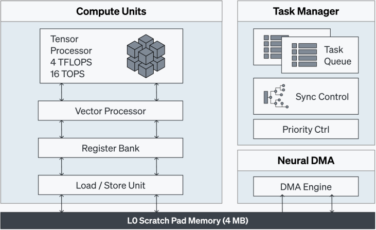
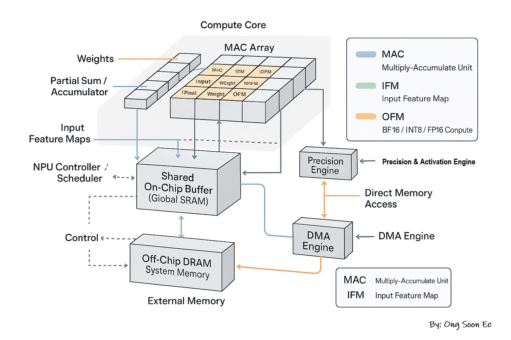
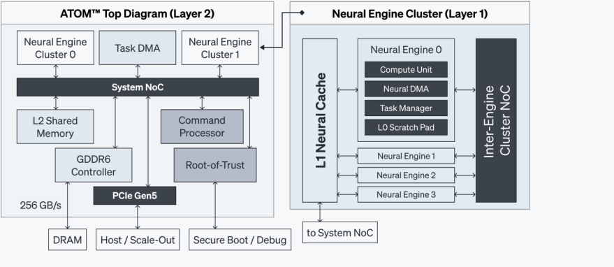
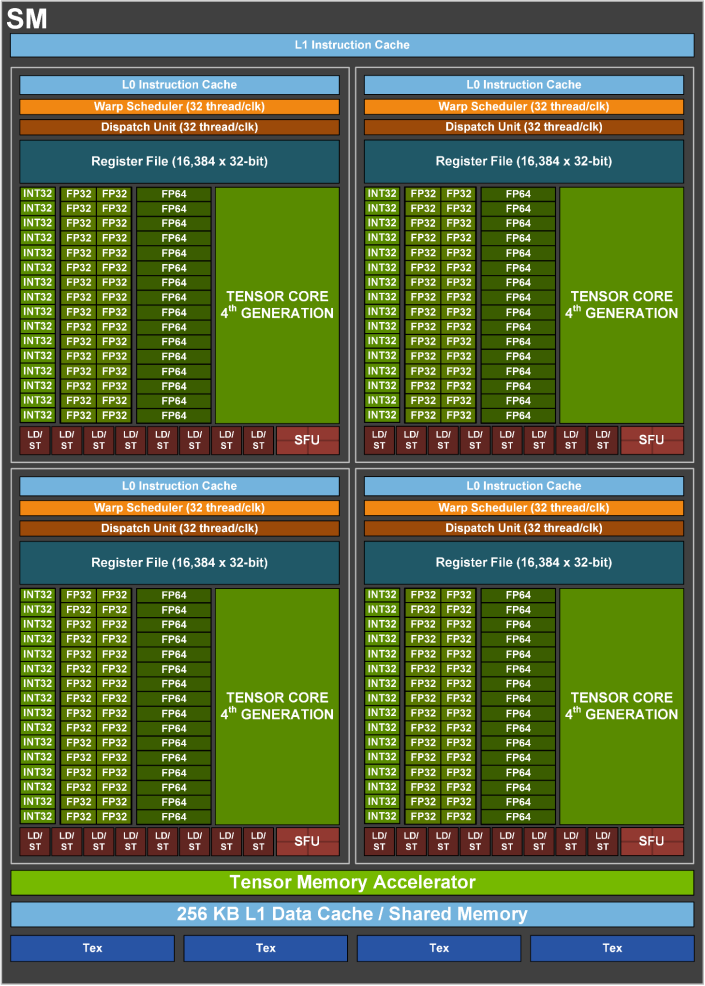
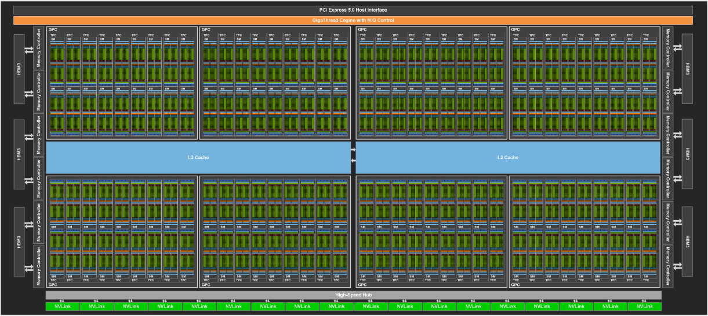
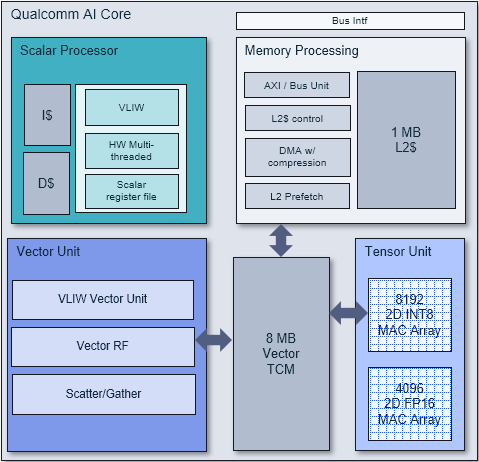
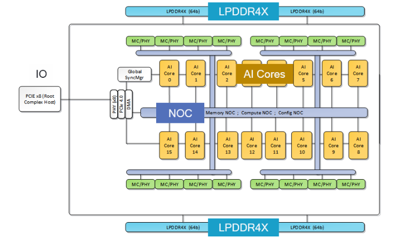
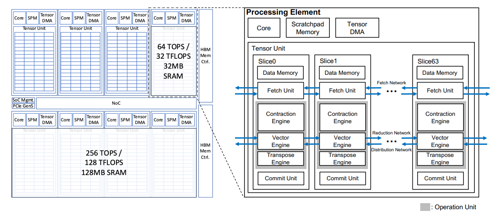

# 02. NPU HW architecture: AI 추론을 위한 전용 하드웨어

## 1. NPU 코어 구조 기본

AI 추론 전용 프로세서(NPU, Neural Processing Unit)의 코어는 크게 다섯 가지 블록으로 나뉜다. 벤더마다 명칭은 다르지만 기본 구성은 거의 동일하다. 이 절에서는 Rebellions ATOM Neural Engine을 기준으로 각 블록의 역할을 설명한다.

  
*[Figure 2. ATOM™ Neural Engine] from Rebellions Whitepaper*

### Tensor Processor

행렬 곱셈(GEMM)과 행렬 덧셈을 처리하는 핵심 연산기다. PyTorch 기준으로 `torch.matmul`, `nn.Linear`, `nn.Conv2d` 등이 이 유닛에서 실행된다. AI 추론 워크로드에서 전체 연산량의 대부분을 차지하기 때문에, NPU 설계에서 가장 많은 실리콘 면적과 전력 예산이 이 유닛에 할당된다.

구현 방식은 벤더에 따라 갈린다. Google TPU의 MXU는 128x128 고정 크기의 Systolic Array를 사용하고, NVIDIA GPU의 Tensor Core는 소형(예: 16x8x32) 행렬 연산 유닛을 SM마다 여러 개 배치한다.  
Qualcomm Cloud AI 100의 AI Core는 클럭당 8,192(INT8) 또는 4,096(FP16) MAC 연산을 처리한다.

### Vector Processor

행렬 곱셈이 아닌, 원소 단위(element-wise) 연산을 담당한다.

- **정규화**: RMSNorm, LayerNorm, BatchNorm
- **활성화 함수**: ReLU, GELU, SiLU, Softmax
- **기타**: 원소별 덧셈, 곱셈, 타입 캐스팅 등

Tensor Processor가 Dense GEMM에 특화된 고정적 구조라면, Vector Processor는 SIMD(Single Instruction, Multiple Data) 방식으로 다양한 비선형 연산을 유연하게 처리한다.

### DMA Engine

Off-chip 메모리(DRAM 또는 HBM)와 코어 내부 SRAM 사이의 데이터 이동을 담당한다. CPU가 관여하지 않고 DMA 하드웨어가 독립적으로 전송을 수행하므로, 연산기가 계산하는 동안 다음 데이터를 미리 가져오는 식의 파이프라이닝이 가능하다. 컴파일러가 컴파일 시점에 DMA 전송 스케줄을 미리 생성하여, 연산과 데이터 이동이 최대한 겹치도록(overlap) 최적화하는 것이 일반적이다.

### Task Manager

컴파일러가 미리 생성해 둔 Instruction 시퀀스를 읽어 각 연산기(Tensor Processor, Vector Processor, DMA Engine)에 명령을 디스패치한다. 타 벤더에서는 일반적으로 Control Unit이라고 부르는 블록이다.  
일반적으로, NPU는 GPU와 달리 런타임에 동적으로 스케줄링하는 것이 아니라, 컴파일러가 정적으로 결정한 실행 순서를 하드웨어가 그대로 따르는 구조가 많다.  
이 덕분에 제어 로직이 단순해지고, 제어 로직이 단순해진 만큼 연산 유닛에 트랜지스터를 더 할당할 수 있다.

### Scratch Pad Memory

일반적으로, Off-chip 메모리의 bandwidth는 연산기의 처리 속도에 비해 훨씬 느리다. 이 격차를 줄이기 위해 코어 내부에 Scratch Pad Memory를 두고, 데이터를 한 번 가져오면 최대한 재사용(data reuse)한 뒤에 내보낸다. 타 벤더에서는 SRAM(Static Random Access Memory) 또는 Local SRAM이라고 부르기도 한다.

예를 들어 거대한 행렬 곱셈을 한 번에 처리할 수 없으므로, 행렬을 타일(tile) 단위로 쪼개어 Scratch Pad Memory에 올리고 연산한 뒤, 다음 타일을 가져오는 방식으로 진행한다.  
이 과정에서 Off-chip memory access 횟수를 줄이는 것이 NPU 성능 최적화의 핵심이다. Tiling 전략과 Scratch Pad Memory 크기 사이의 균형이 컴파일러 최적화에서 가장 까다로운 문제 중 하나이기도 하다.

이 다섯 가지 블록(Tensor Processor, Vector Processor, DMA Engine, Task Manager, Scratch Pad Memory)이 모여 하나의 NPU 코어를 구성한다. 벤더 명칭을 걷어내고 데이터 흐름만 그리면 아래와 같은 형태가 된다. MAC Array가 Tensor Processor, Shared On-Chip Buffer가 Scratch Pad Memory, NPU Controller/Scheduler가 Task Manager에 해당하고, Off-Chip DRAM과 버퍼 사이를 DMA Engine이 오간다.

  
*[Generic NPU Compute Core Dataflow] by Ong Soon Ee*

다음 절에서는 이 코어를 N개 배열하고 NoC로 연결한 SoC 구조를 살펴본다.

---

## 2. 멀티 코어로의 확장: NPU SoC 아키텍처

실제 제품에서는 위에서 설명한 코어 하나만으로 칩이 구성되지 않는다. 대부분의 벤더가 기본 코어를 N개 배열하고, 코어 간을 NoC(Network-on-Chip)로 연결하여 하나의 SoC를 구성한다.  
하나의 모델이나 연산을 여러 코어에 분할(partitioning)하여 병렬로 처리할 수 있고, 반대로 코어별로 서로 다른 모델을 독립적으로 실행할 수도 있다.

### 대표 예시: Rebellions ATOM SoC

Rebellions의 ATOM은 Samsung 5nm EUV 공정으로 제조된 AI 추론 전용 SoC다.

- **코어 구성**: 8개의 Neural Engine(ION 코어)이 NoC로 연결
- **메모리 계층**:
  - Neural Engine당 4MB Local SRAM (Scratchpad)
  - 32MB L2 SRAM (전체 Neural Engine 공유)
  - 16GB GDDR6 Off-chip DRAM (256 GB/s bandwidth)
- **호스트 인터페이스**: PCIe Gen5 x16

  
*[Figure 1. ATOM™ Multi-layered SoC Architecture] from Rebellions Whitepaper*

SoC나 HW 등에 익숙하지 않으면 생소할 수 있으나, 대부분의 AI 가속기의 구조가 이러한 계층 구조를 따른다.

### 추가 예시 1: NVIDIA H100

H100은 NPU가 아닌 GPU지만, "코어(SM) N개를 인터커넥트로 연결하여 하나의 칩을 구성한다"는 기본 패턴은 동일하다. 132개의 SM이 하나의 칩을 이루며, 각 SM 내부에 Tensor Core(행렬 연산), CUDA Core(범용 연산), Warp Scheduler, Shared Memory/L1 Cache가 배치되어 있다.

  
*[Figure 7. GH100 Streaming Multiprocessor (SM)] from NVIDIA Whitepaper*

  
*[Figure 6. GH100 Full GPU with 144 SMs] from NVIDIA Whitepaper*

### 추가 예시 2: Qualcomm Cloud AI 100

16개의 AI Core가 NoC로 연결된 구조다. 각 AI Core 내부에 Matrix/Vector Processor와 Local SRAM이 있으며, Off-chip 메모리로 LPDDR4X를 사용한다.

  
*[Qualcomm AI Core] from Qualcomm Architecture*

  
*[Qualcomm Cloud AI 100 SoC] from Qualcomm Architecture*

### 추가 예시 3: FuriosaAI RNGD

8개의 PE(Processing Element)로 구성된다. 각 PE 내부에 CPU Core(제어), Tensor Unit(행렬 연산), Tensor DMA가 있으며, PE를 최대 4개까지 묶어 하나의 큰 연산 단위로 동작시킬 수 있다.

  
*[Figure 5. Overall architecture of RNGD and the internal components of the Processing Element (PE)] from Hot Chips 2024*

---

## Reference

- [Qualcomm Cloud AI 100 Architecture](https://quic.github.io/cloud-ai-sdk-pages/1.11/Getting-Started/Architecture/)
- [Rebellions Whitepaper](https://rebellions.ai/wp-content/uploads/2026/03/Rebellions_Whitepaper_EN_v.01.pdf)
- [NVIDIA H100 Tensor Core GPU Architecture Whitepaper](https://resources.nvidia.com/en-us-hopper-architecture/nvidia-h100-tensor-c)
- [Tensor Contraction Processor (FuriosaAI RNGD, IEEE Micro 2025)](https://web.ist.utl.pt/nuno.lopes/pubs/tcp-micro25.pdf)

