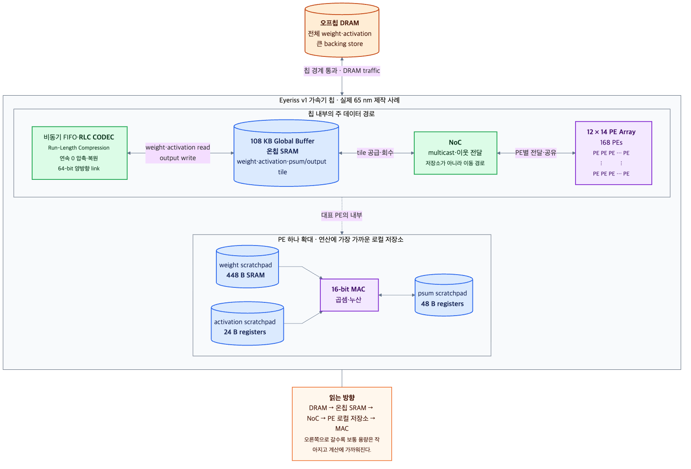
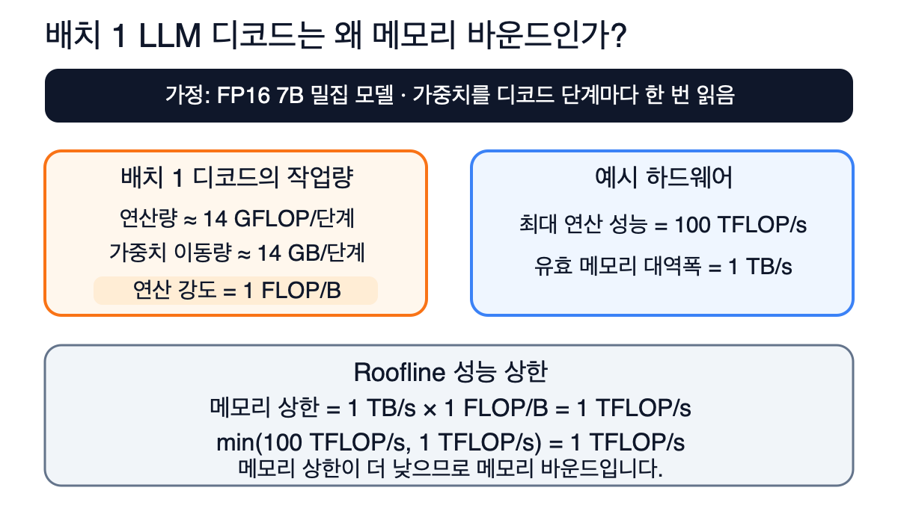
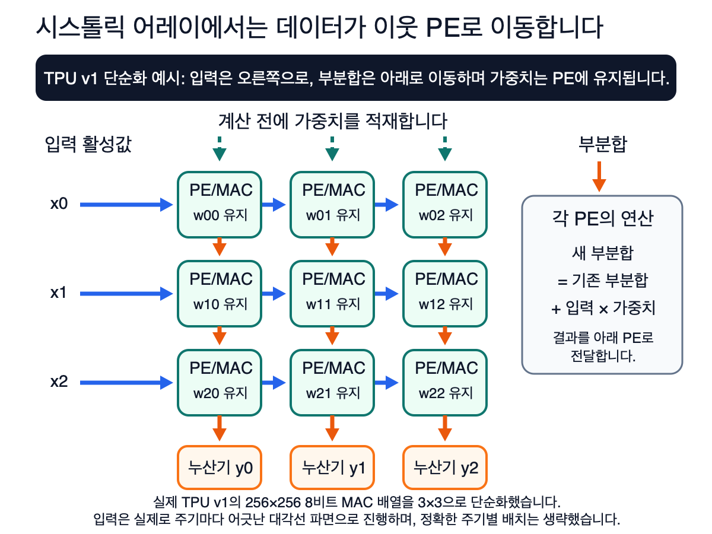

# 03. NPU 메모리 계층과 데이터 재사용

> 담당(오너): 이영준  ·  관련 세미나 주차: ⬜  ·  상태: 초안 (실습 채움 필요)

## 개요

[1장](01-npu-intro.md)에서는 연산 능력보다 데이터 공급 속도가 성능을 제한하는 메모리 병목을 소개했고, [2장](02-gpu-vs-npu.md)에서는 GPU와 NPU가 모두 가까운 저장공간에서 데이터를 재사용하려는 이유를 Eyeriss의 상대 에너지 값으로 확인했습니다. 이 장은 그 두 장이 예고한 내용을 한 단계 깊이 다룹니다.

핵심 결론은 하나입니다. 현대 AI 칩의 성능은 연산 처리 능력과 데이터 공급 능력 중 더 낮은 쪽의 제한을 받습니다. 데이터 재사용이 적은 워크로드에서는 **데이터 이동**이 주된 한계가 되며, 이를 개선하는 핵심 구조가 **메모리 계층(memory hierarchy)**입니다.

각 절은 요리사와 주방이라는 비유로 직관을 먼저 잡고, 이어서 식과 수치로 마무리합니다. 하드웨어를 처음 접한다면 그림과 비유를 먼저 살펴보고, 엔지니어라면 식과 수치를 중심으로 확인하시면 됩니다.

이 장을 읽고 나면 다음 질문에 답할 수 있어야 합니다.

1. 왜 계산보다 데이터 이동이 더 비쌉니까?
2. 레지스터, 스크래치패드, 글로벌 버퍼, DRAM은 각각 어떤 역할을 하고 누가 관리합니까?
3. NPU는 왜 CPU의 캐시 대신 컴파일러가 관리하는 스크래치패드를 주로 씁니까?
4. 타일링은 무엇을 줄이고 무엇을 줄이지 못합니까?
5. Roofline 모델로 어떤 작업이 메모리 바운드인지 연산 바운드인지 어떻게 판단합니까?
6. 데이터플로우는 무엇을 고정하고 무엇을 흘리는 선택입니까?

## 배경 / 이론

### 1. 메모리 벽: 계산보다 데이터 전송이 비쌉니다

#### 직관: 초고속 주방과 멀리 있는 마트

AI 모델의 계산은 본질적으로 곱셈과 덧셈으로 이루어진 MAC(Multiply-Accumulate) 연산을 대량으로 반복하는 작업입니다. 이 계산을 수행하는 PE(Processing Element)는 구현 면적과 비용이 비교적 작습니다. 칩에 수천 개의 PE를 배치하여 연산 성능을 높이는 일 자체는 어렵지 않습니다. 그래서 최신 가속기는 수백 테라플롭스의 성능을 제공할 수 있습니다.

문제는 연산에 필요한 데이터를 공급하는 일입니다. 모델의 수억 개 가중치와 입력 데이터는 대개 칩 바깥의 대용량 메모리인 DRAM에 저장되어 있으므로, 계산할 때마다 칩 안으로 가져와야 합니다. 주방에 비유하면 다음과 같습니다. **요리사가 아무리 빠르게 일해도 재료를 마트에서 가져오는 속도가 느리면 주방은 멈춥니다.** 초고속 전문 주방의 요리사들이 작업을 멈추고 배달 트럭만 기다리는 상황이 바로 반도체 업계에서 말하는 **메모리 벽(memory wall)**입니다. 수십 년 동안 연산 속도가 데이터 전송 속도보다 훨씬 빠르게 향상되면서 이러한 격차가 누적되었습니다.

#### 심화: 메모리 벽은 에너지 문제입니다

메모리 벽은 속도 문제이기 이전에 에너지 문제입니다. 아래 표의 수치는 MIT Eyeriss 연구팀이 정리한 것으로, 업계에서 표준 자료처럼 인용됩니다. 2장에서 소개한 `1·2·6·200`과 같은 값입니다.

| 접근 대상 | MAC 1회 대비 상대 에너지 | 비고 |
|---|---|---|
| 레지스터 파일 (PE 내부) | 약 1× | 연산과 같은 자릿수 |
| 이웃 PE 간 전달 (NoC) | 약 2× | 배선 수십~수백 µm |
| 글로벌 버퍼 (온칩 SRAM) | 약 6× | 온칩, 수 mm 배선 |
| 오프칩 DRAM | **약 200×** | 패키지 밖, I/O 구동 포함 |

데이터를 칩 밖에서 한 번 가져오는 비용이 그 데이터로 연산을 이백 번 수행하는 비용과 같다는 뜻입니다. 공정이 미세화되면 연산 에너지는 크게 줄어들지만, 배선과 I/O 에너지는 훨씬 느리게 감소합니다. 따라서 이 격차는 세대가 바뀔수록 커집니다.

계층별 가중치 접근·이동 에너지는 다음과 같이 근사할 수 있습니다.

```text
E_weight ≈ Σ_l N_l × e_l
N_l: 메모리 계층 또는 경계 l에서 가중치에 접근하거나 가중치를 이동한 횟수
e_l: 해당 계층 또는 경계에서 가중치 하나에 접근하거나 가중치를 이동할 때의 상대 에너지
```

간단한 CNN 연산으로 계산해 보겠습니다. 입력 텐서의 크기가 `[1,1,5,5]`, 가중치 텐서의 크기가 `[2,1,3,3]`, 출력 텐서의 크기가 `[1,2,3,3]`인 합성곱(CONV)을 가정합니다. 가중치는 `2×1×3×3=18개`이고, 각 가중치는 출력의 `3×3=9개` 위치에서 사용됩니다. 따라서 전체 가중치 사용 횟수는 `18×9=162회`이며, 전체 MAC 수도 `162 MAC`입니다.

가중치가 16비트 정수(INT16)여서 하나의 크기가 2B라고 가정하면 다음과 같이 계산할 수 있습니다.

| 가중치 처리 방식 | DRAM 가중치 접근 | DRAM 트래픽 | DRAM 에너지 항 |
|---|---:|---:|---:|
| DRAM에서 매번 읽음 | `162회` | `162×2B=324B` | `162×200=32,400` 상대 단위 |
| 각 가중치를 한 번만 읽고 온칩에서 재사용 | `18회` | `18×2B=36B` | `18×200=3,600` 상대 단위 |

두 방식은 동일하게 `162 MAC`을 수행하지만, 온칩에서 가중치를 재사용하면 가중치의 DRAM 트래픽과 DRAM 에너지 항이 각각 **9배 감소**합니다. 다만 이 계산은 가중치의 DRAM 접근 항목만 비교한 것입니다. 글로벌 버퍼·NoC·레지스터 파일 접근과 입력·부분합·출력 이동은 포함하지 않으므로, NPU 전체 에너지나 실행 시간이 9배 줄어든다는 뜻은 아닙니다. 각 계층의 실제 접근 횟수 `N_l`은 데이터플로우와 매핑에 따라 별도로 계산해야 하며, 표의 상대 에너지 계수도 65nm 공정에 기반한 조건부 예시값입니다.

> **핵심:** DRAM 접근 1회에는 MAC 연산 약 200회와 비슷한 에너지가 필요합니다. 따라서 NPU 설계의 제1원칙은 "더 빨리 계산하자"가 아니라 **"에너지 비용이 큰 DRAM 접근 횟수를 줄이자"**입니다. 이 장의 나머지 내용은 이 원칙을 구체적으로 설명합니다.

### 2. 메모리 계층: 주방의 네 창고

#### 직관: 요리사가 재료를 찾는 순서

DRAM 접근 횟수를 줄이려면 어떻게 해야 할까요? 답은 일상에서도 사용하는 전략에 있습니다. 요리사는 재료가 필요할 때 다음 순서로 찾습니다.

1. **손에 든 재료:** 즉시 사용할 수 있지만 한두 개만 들 수 있습니다.
2. **바로 옆 조리대:** 손만 뻗으면 사용할 수 있습니다.
3. **주방 냉장고:** 몇 걸음 걸어야 하지만 비교적 많은 재료를 보관할 수 있습니다.
4. **동네 마트:** 필요한 재료가 모두 있지만 다녀오는 데 오랜 시간이 걸립니다.

유능한 요리사는 재료 하나를 살 때마다 마트에 다녀오지 않습니다. **마트에 한 번 갈 때 필요한 재료를 대량으로 사 와서 냉장고에 채우고, 당장 사용할 재료만 조리대에 꺼내 놓습니다.**

#### 심화: NPU의 표준 구조

이 전략을 실리콘에 그대로 구현한 것이 NPU의 표준 구조입니다. 계층 사이의 데이터 이동은 DMA 엔진(DRAM↔글로벌 버퍼)과 온칩 네트워크인 NoC(글로벌 버퍼↔PE)가 담당합니다.

이 일반 구조를 실제 칩에 대응해 보면 다음과 같습니다. Eyeriss v1에서는 데이터를 오프칩 DRAM에서 108 KB 온칩 글로벌 버퍼로 가져온 뒤, NoC를 통해 PE 배열에 전달합니다. 각 PE는 전달받은 데이터를 로컬 저장소에서 재사용하면서 16-bit MAC 연산을 수행합니다.



*그림 1. Eyeriss v1의 메모리 계층과 데이터 이동 경로. 화살표는 입력을 읽는 방향뿐 아니라 계산한 결과를 반대 방향으로 기록하는 경로도 나타냅니다. 실제 65 nm Eyeriss v1의 공개 구조와 칩 사양을 학습용으로 재구성한 그림입니다.*

| 계층 | 주방 비유 | 구현 | 대략적 용량 | 관리 주체 |
|---|---|---|---|---|
| 레지스터 파일 (RF) | 손에 든 재료 | 플립플롭/소형 SRAM | 수십 B ~ 수 KB/PE | 하드웨어 파이프라인 |
| PE 로컬 스크래치패드 | 조리대 | SRAM | 수백 B ~ 수십 KB/PE | 컴파일러 (정적) |
| 글로벌 버퍼 (GLB) | 냉장고 | SRAM (뱅크 분할) | 수백 KB ~ 수십 MB | 컴파일러 (정적) |
| 오프칩 DRAM | 마트 | HBM / LPDDR / DDR | 수 GB ~ 수백 GB | 런타임/DMA 스케줄 |

원리는 하나입니다. **가까운 메모리일수록 용량이 작고 속도가 빠르며 접근 비용이 낮습니다. 반대로 먼 메모리일수록 용량이 크고 속도가 느리며 접근 비용이 높습니다.**

#### 심화: 왜 "크고 빠른 하나의 메모리"는 없습니까

"빠른 메모리를 크게 만들면 되지 않나요?"라는 질문을 자주 받습니다. 물리적 제약 때문에 그렇게 만들기 어렵습니다.

- **셀 밀도:** 온칩 SRAM은 비트당 트랜지스터 6개(6T)를 사용하지만, DRAM은 트랜지스터 1개와 커패시터 1개(1T1C)를 사용합니다. 따라서 같은 면적에 DRAM이 수십 배 더 많은 데이터를 저장할 수 있습니다. 반대로 말하면 온칩 SRAM 1MB를 추가할 때는 그만큼 다이 면적을 더 사용하며 비용도 증가합니다.
- **크기와 지연의 관계:** 메모리가 커지면 내부 배선이 길어지고 디코딩 단계가 늘어납니다. 따라서 같은 SRAM이라도 8KB와 1MB는 접근 에너지에 한 자릿수 이상의 차이가 납니다. **크면서 빠른 메모리를 만들기 어려운 이유입니다.**
- **참고, HBM이란:** DRAM 다이를 수직으로 쌓고 초광폭 인터페이스로 칩 바로 옆에 연결한 구조입니다. 비유하면 "마트를 주방 옆으로 옮긴" 설계입니다.

> **핵심:** 계층화는 설계 취향이 아니라 밀도·지연·비용의 물리적 제약에서 비롯된 결과입니다. 설계자는 각 계층의 크기를 어떻게 배분할지와 **각 계층을 누가 관리할지**를 결정합니다. 특히 관리 주체의 차이가 NPU와 CPU를 구분하는 중요한 기준입니다.

#### 리벨리온 NPU에 대입해 보기

2장에서 ATOM 계열의 저장공간으로 GDDR6, Shared SRAM, Neural Cache와 Scratch Pad를 소개했습니다. 위 표의 일반 계층에 대응시키면 GDDR6가 오프칩 DRAM, Shared SRAM이 글로벌 버퍼, Neural Engine 안의 Scratch Pad가 PE 로컬 스크래치패드에 가깝습니다.

> 📝 실습 채움: 우리가 쓰는 ATOM 제품의 각 계층 용량과 외부 메모리 대역폭을 공식 사양·백서에서 확인해 표로 추가합니다. 추정값은 적지 않습니다.

### 3. 캐시와 스크래치패드: 자동문과 수동문

#### 직관: 관리 방식의 차이

가까운 저장소를 두는 방식은 CPU에도 있으며, 대표적인 예가 캐시(cache)입니다. 차이는 관리 방식에 있습니다.

| | CPU 캐시 | NPU 스크래치패드 |
|---|---|---|
| 누가 관리합니까? | 하드웨어가 **자동으로** 관리 | 컴파일러가 **직접 계획하여** 관리 |
| 동작 방식 | 태그를 조회해 요청한 데이터가 캐시에 있는지 확인하고, 캐시 미스가 발생하면 하드웨어가 데이터를 자동으로 적재하며 필요하면 기존 캐시 라인을 교체합니다. | 컴파일러가 정한 시점과 위치에 데이터를 명시적으로 배치합니다. |
| 비유 | **자동문:** 편리하지만 의도대로 작동하지 않을 때도 있음 | **수동문:** 번거롭지만 계획대로 작동함 |

#### 심화: 왜 수동으로 관리합니까

NPU에서 스크래치패드(scratchpad)를 명시적으로 관리하는 이유는 정형화된 텐서 연산의 데이터 주소, 접근 순서, 수명을 컴파일 시점에 미리 파악할 수 있기 때문입니다. 이러한 워크로드에서는 컴파일러가 스크래치패드의 데이터 배치와 전송을 직접 계획할 수 있습니다. 따라서 캐시의 태그 조회와 캐시 라인 교체 관리에 필요한 하드웨어를 줄여 면적과 접근 에너지를 절감할 수 있습니다. 또한 대형 텐서를 한 번씩 순차적으로 읽으면 재사용하지 않을 데이터가 캐시에 계속 들어오면서 재사용 가치가 높은 데이터를 밀어낼 수 있습니다. **규칙적인 접근 패턴에서는 컴파일러가 미리 정한 데이터 이동 계획이 하드웨어 캐시의 동적 관리보다 효율적일 수 있습니다.**

또한 모든 접근에 필요한 사이클 수가 확정되므로 **결정론적 성능**을 얻을 수 있습니다. 다만 성능 최적화의 책임이 하드웨어에서 컴파일러로 이동합니다. 따라서 NPU 생태계에서는 컴파일러의 품질이 하드웨어 사양만큼 중요합니다. 2장에서 본 것처럼 RBLN 컴파일러가 타일링, 버퍼 구성과 메모리 할당을 미리 계획해 `.rbln` 실행물에 담는 것도 같은 이유입니다. 컴파일 옵션이 성능에 미치는 영향은 [6장](06-compile-optimize.md)에서 실습합니다.

### 4. 타일링: 큰 데이터를 나누어 전송하기

#### 직관: 100인분 잔치 요리와 10인분짜리 냉장고

현실적인 문제가 하나 남아 있습니다. 모델 데이터는 수 기가바이트이지만 칩 안의 냉장고에 해당하는 글로벌 버퍼는 수 메가바이트에 불과하므로, 전체 데이터를 한 번에 저장할 수 없습니다. 100인분의 잔치 요리를 해야 하지만 냉장고에는 10인분만 보관할 수 있는 상황과 같습니다. 해결 방법은 **10인분씩 열 번에 걸쳐** 재료를 가져오고, 조리하고, 내보내는 것입니다. 한 번 가져온 10인분의 재료는 **남김없이 사용한 뒤** 다음 재료를 가져옵니다. 이것이 **타일링(tiling)**입니다.

#### 그림으로 이해하기: 필요한 타일만 온칩에 올려 재사용하기

일반 행렬 곱셈(GEMM, General Matrix Multiplication) `C = A × B`에서 C의 한 타일을 계산하려면 A와 B에서 현재 출력 구간에 필요한 타일만 있으면 됩니다. 현재 C 타일의 한 K 구간을 계산할 때 두 입력 타일을 DRAM에서 온칩 SRAM으로 가져온 뒤, PE 배열의 여러 MAC 연산에서 반복해서 사용합니다. 이후 A의 열과 B의 행이 만나는 K 차원에서 다음 타일 쌍을 가져와 같은 C 타일의 부분합에 누적합니다.


*그림 2. GEMM 타일링과 온칩 데이터 재사용. 파란색 A 타일과 주황색 B 타일을 온칩 SRAM에 적재하고, 여러 MAC에서 재사용하여 초록색 C 타일의 부분합을 계산합니다. K 차원의 다음 타일 쌍으로 이동하면 같은 과정을 반복합니다.*

타일링을 적용해도 전체 MAC 연산 횟수는 바뀌지 않습니다. 대신 같은 A와 B의 값을 MAC 연산마다 DRAM에서 다시 읽는 횟수를 줄입니다. 타일은 온칩 저장소에 들어갈 만큼 작아야 하지만, 지나치게 작으면 같은 데이터를 다시 가져오는 횟수가 늘어납니다. 따라서 타일 크기는 SRAM 용량과 PE 배열 구조를 함께 고려하여 정합니다.

> **자료 근거:** [NVIDIA CUDA C++ Best Practices Guide](https://docs.nvidia.com/cuda/cuda-c-best-practices-guide/index.html#shared-memory-in-matrix-multiplication-c-ab)는 스레드 블록이 사용할 A와 B의 타일을 공유 메모리(shared memory)에 적재하여 중복 전역 메모리 전송을 줄이는 행렬 곱셈 예제를 설명합니다. [Moon et al., *Evaluating Spatial Accelerator Architectures with Tiled Matrix-Matrix Multiplication*](https://arxiv.org/abs/2106.10499)은 NPU와 같은 공간형 가속기에서 버퍼 계층, 데이터플로우, 타일 크기를 함께 고려하여 데이터 재사용을 최적화하는 방법을 다룹니다. 그림은 두 자료의 원리를 바탕으로 이 책에 맞게 새로 제작했습니다.

### 5. Roofline: 연산과 데이터 전송 중 무엇이 성능을 제한합니까

#### 핵심 개념: 두 가지 성능 한계 중 작은 값이 적용됩니다

Roofline 모델은 실행 시간을 정확하게 예측하는 모델이 아닙니다. 특정 하드웨어에서 작업이 넘을 수 없는 **성능 상한**을 계산하고, 연산기와 메모리 중 어느 쪽이 먼저 성능을 제한하는지 판단하는 모델입니다.

- **최대 연산 성능:** 연산기가 1초 동안 처리할 수 있는 최대 연산 수입니다.
- **데이터 전송이 허용하는 성능:** 메모리 대역폭에 연산 강도를 곱한 값입니다.

연산 강도(arithmetic intensity)는 메모리에서 1바이트를 옮길 때 수행하는 연산 수입니다. 단위는 일반적으로 `OP/B`이며, 부동소수점 연산만 셀 때는 `FLOP/B`를 사용합니다. 이 장에서는 **오프칩 DRAM(HBM·GDDR·LPDDR 등)과 칩 사이를 통과한 바이트**를 기준으로 계산합니다.

```text
데이터 전송이 허용하는 성능 = 메모리 대역폭 × 연산 강도
성능 상한 = min(최대 연산 성능, 데이터 전송이 허용하는 성능)
실제 성능 ≤ 성능 상한
```


*그림 3. Roofline의 두 가지 성능 한계. 연산 강도가 낮아서 데이터 전송이 성능을 제한하는 영역은 메모리 바운드(memory-bound)입니다. 연산 강도가 높아서 연산기가 성능을 제한하는 영역은 연산 바운드(compute-bound)입니다. 두 값이 같아지는 지점을 기준으로 제한 요인이 바뀝니다. 축 간격은 계산 관계를 쉽게 보여 주기 위해 선형으로 단순화했습니다.*

예를 들어 최대 연산 성능이 `1,000 GOP/s`이고 메모리 대역폭이 `100 GB/s`인 하드웨어를 가정하겠습니다. 두 값이 같아지는 연산 강도는 `1,000 ÷ 100 = 10 OP/B`입니다.

두 상한 중 데이터 전송이 허용하는 성능이 더 작으면 **메모리 바운드(memory-bound)**, 최대 연산 성능이 더 작으면 **연산 바운드(compute-bound)**라고 부릅니다.

- 연산 강도가 `2 OP/B`라면 데이터 전송이 허용하는 성능은 `100 × 2 = 200 GOP/s`입니다. 이는 메모리가 최대 `200 GOP/s`의 연산을 뒷받침할 만큼의 데이터만 공급할 수 있다는 뜻입니다. 연산기는 최대 `1,000 GOP/s`를 처리할 수 있지만, 데이터 공급 상한이 더 낮으므로 성능은 `200 GOP/s`를 넘을 수 없습니다. 따라서 데이터 전송이 성능을 제한하는 메모리 바운드 상태입니다.
- 연산 강도가 `20 OP/B`라면 데이터 전송이 허용하는 성능은 `100 × 20 = 2,000 GOP/s`입니다. 이 경우 메모리는 최대 연산 성능인 `1,000 GOP/s`를 사용하는 데 필요한 데이터를 충분히 공급할 수 있습니다. 그러나 연산기는 최대 `1,000 GOP/s`까지만 처리할 수 있으므로 성능 상한은 `1,000 GOP/s`입니다. 따라서 연산기가 성능을 제한하는 연산 바운드 상태입니다.

이 값들은 실제 측정값이 아니라 이론적인 상한입니다. 실제 성능은 병렬 처리량, 메모리 접근 패턴, 통신과 실행 오버헤드의 영향으로 더 낮을 수 있습니다.

> **자료 근거:** [Williams, Waterman, Patterson의 Roofline 원 논문](https://escholarship.org/uc/item/78h8v7mr)은 연산 강도와 두 성능 한계를 이용하여 성능 상한을 정의합니다. [NVIDIA GPU Performance Background](https://docs.nvidia.com/deeplearning/performance/dl-performance-gpu-background/index.html#understanding-performance)는 연산 수, 이동 바이트, 연산 성능과 메모리 대역폭을 같은 방식으로 비교하며, 이 분석이 일차적인 근사임을 설명합니다.

#### LLM 디코드에서 메모리 대역폭이 중요한 이유

배치 1의 자기회귀 디코드는 한 단계에서 새 토큰 하나를 만듭니다. FP16 7B 밀집 모델의 가중치는 약 `14 GB`이며, 모델이 온칩 저장소보다 크면 한 단계마다 가중치를 오프칩 메모리에서 읽어야 합니다. 이때 주요 행렬 연산은 약 `14 GFLOP/단계`입니다.



*그림 4. 배치 1 LLM 디코드의 Roofline 판정. 아래 수치는 가중치 이동만 고려한 단순한 예시입니다.*

최대 연산 성능이 `100 TFLOP/s`이고 유효 오프칩 메모리 대역폭이 `1 TB/s`인 장치를 가정하겠습니다.

```text
연산 강도 = 14 GFLOP/단계 ÷ 14 GB/단계 = 1 FLOP/B
메모리 상한 = 1 TB/s × 1 FLOP/B = 1 TFLOP/s
Roofline 성능 상한 = min(100 TFLOP/s, 1 TFLOP/s) = 1 TFLOP/s
```

메모리 상한인 `1 TFLOP/s`가 최대 연산 성능인 `100 TFLOP/s`보다 낮으므로 이 작업은 메모리 바운드입니다. `14 GFLOP`라는 연산량 자체가 작은 것이 아니라, 가중치 1바이트당 수행하는 연산이 1 FLOP뿐이어서 메모리가 연산기에 데이터를 충분히 공급하지 못합니다.

배치 1에서는 `1단계 = 1토큰`이므로, 가중치만 고려한 토큰 생성률의 상한은 `(1,000 GB/s) ÷ (14 GB/단계) ≈ 71 단계/s = 71 token/s`입니다. 실제 속도는 KV 캐시와 활성값 이동, 실행 오버헤드 때문에 더 낮을 수 있습니다.

이 계산은 뒤의 서빙 장들과 바로 이어집니다. 배치를 키우면 같은 가중치를 여러 시퀀스가 나눠 쓰므로 가중치 1바이트당 연산이 늘어나고, 양자화로 가중치의 바이트 수를 줄이면 같은 대역폭으로 더 많은 단계를 처리할 수 있습니다. 이것이 [9장](09-vllm-basics.md)에서 다루는 배치와 처리량의 관계, [6장](06-compile-optimize.md)에서 다루는 양자화의 효과를 메모리 계층 관점에서 설명하는 방법입니다.

> **자료 근거:** [NVIDIA GPU Performance Background](https://docs.nvidia.com/deeplearning/performance/dl-performance-gpu-background/index.html#understanding-performance)는 배치 1인 선형 계층의 연산 강도를 `1 FLOP/B`로 제시합니다. [Pope et al., *Efficiently Scaling Transformer Inference*](https://arxiv.org/html/2211.05102v1)는 디코드 단계마다 가중치와 KV 캐시를 HBM에서 연산 코어로 옮기며, 매개변수가 N개인 디코더 전용 모델의 행렬 연산량이 토큰당 약 `2N FLOP`이라고 설명합니다.

### 6. 데이터플로우: 한 번 가져온 데이터는 최대한 재사용합니다

#### 직관: 재사용할 수 있는 세 가지 데이터

연산 강도를 높이는 핵심은 데이터 재사용입니다. MAC 연산보다 약 200배 많은 에너지를 사용하여 DRAM에서 가져온 데이터는 내보내기 전에 최대한 여러 번 사용해야 합니다.

| 재사용 종류 | 재사용이 발생하는 이유 | 비유 |
|---|---|---|
| 가중치 재사용 | 같은 가중치가 여러 입력에 곱해짐 | 도장 하나로 지나가는 종이마다 찍기 |
| 입력 재사용 | 같은 입력이 여러 가중치와 곱해짐 | 종이를 눌러둔 채 도장을 바꿔가며 찍기 |
| 부분합 재사용 | 중간 결과를 제자리에서 계속 누적 | 냄비를 불에 올려둔 채 재료를 계속 넣기 |

재사용 효과를 수치로 살펴보겠습니다. 3×3 필터를 100×100 이미지에 적용하면 가중치 9개를 한 번만 적재한 뒤 약 1만 번 재사용할 수 있습니다.

#### 심화: 데이터플로우 분류

온칩 저장 공간이 작기 때문에 세 가지 재사용을 동시에 극대화할 수는 없습니다. 어떤 데이터를 계산기 옆에 고정할지 선택해야 하며, 이러한 선택 방식을 **데이터플로우(dataflow)**라고 부릅니다. "Stationary(고정)" 앞에 붙은 단어가 고정할 대상을 나타냅니다.

| 데이터플로우 | PE에 고정 | 극대화되는 재사용 | 대가 | 대표 |
|---|---|---|---|---|
| Weight Stationary | 가중치 | 가중치(필터별 수천 회) | 부분합이 PE 사이를 이동함 | Google TPU(시스톨릭) |
| Output Stationary | 부분합 | 부분합(RF 밖으로 이동하지 않음) | 가중치와 입력을 반복해서 공급함 | ShiDianNao 등 |
| Input Stationary | 입력 활성값 | 입력 | 가중치 스트리밍 | 일부 희소 가속기 |

루프 관점에서 보면 데이터플로우는 타일링 루프 중 어떤 루프를 PE 배열이라는 공간에 펼치고, 어떤 인덱스를 가장 안쪽에 두어 고정할지를 결정하는 방식입니다. **즉 타일링과 데이터플로우는 하나의 스케줄링 문제를 바라보는 두 가지 관점입니다.**

#### 심화: 시스톨릭 어레이와 물동이 릴레이

TPU v1의 행렬 곱셈 장치는 가중치를 미리 적재하는 **시스톨릭 어레이(systolic array)**입니다. 과거 소방수들이 물동이를 전달할 때 각자 우물까지 다녀오는 대신, 한 줄로 서서 옆 사람에게 물동이를 넘기던 방식과 비슷합니다.



*그림 5. 시스톨릭 어레이의 데이터 이동. TPU v1의 실제 256×256 8비트 MAC 배열을 3×3으로 단순화했습니다. 가중치는 연산 전에 위쪽에서 각 PE로 적재되어 한 타일을 처리하는 동안 유지됩니다. 입력 활성값은 오른쪽으로 이동하고, 각 PE가 갱신한 부분합은 아래쪽 PE와 누산기 뱅크로 전달됩니다. 실제 입력은 파이프라인에 맞추어 대각선 파면 형태로 진행하며, 그림에서는 정확한 주기별 배치를 생략했습니다.*

각 PE는 `새 부분합 = 기존 부분합 + 입력 × 가중치`를 계산하고 결과를 이웃한 PE로 전달합니다. 따라서 매 MAC 연산마다 큰 버퍼를 다시 읽고 쓰는 대신, PE에 둔 가중치를 재사용하고 입력과 부분합을 짧은 배선으로 전달할 수 있습니다. 다만 행렬 크기가 배열 크기와 맞지 않으면 일부 PE가 쉬게 되어 가동률이 낮아질 수 있습니다.

> **자료 근거:** [Jouppi et al., *In-Datacenter Performance Analysis of a Tensor Processing Unit*](https://arxiv.org/pdf/1704.04760)은 TPU v1에서 입력이 왼쪽에서 들어오고 가중치를 위쪽에서 미리 적재하며 연산이 대각선 파면으로 진행된다고 설명합니다. [Google Cloud TPU 아키텍처 문서](https://docs.cloud.google.com/tpu/docs/system-architecture-tpu-vm)는 MAC이 직접 연결된 시스톨릭 어레이에서 곱셈 결과가 다음 MAC으로 전달되는 과정을 설명합니다.

### 7. 정리: 다섯 문장으로 핵심 정리하기

1. AI 칩의 성능은 연산 처리 능력과 데이터 공급 능력 중 더 낮은 쪽의 제한을 받으며, 에너지 비용이 큰 DRAM 접근을 줄이는 것이 NPU 설계의 핵심입니다.
2. 레지스터, 스크래치패드, 글로벌 버퍼, DRAM으로 이어지는 메모리 계층은 가까운 데이터일수록 더 빠르고 적은 에너지로 사용할 수 있도록 구성됩니다.
3. NPU는 규칙적인 텐서 접근을 미리 예측할 수 있으므로, 컴파일러가 스크래치패드의 데이터 배치와 전송 시점을 직접 계획합니다.
4. 타일링과 데이터플로우는 같은 데이터를 온칩에서 재사용하도록 계산을 배치하며, 시스톨릭 어레이는 가중치를 PE에 유지한 채 입력과 부분합을 이웃한 PE로 전달합니다.
5. Roofline은 최대 연산 성능과 `메모리 대역폭 × 연산 강도` 중 더 작은 값을 성능 상한으로 선택하며, 배치 1의 FP16 7B LLM 디코드는 예시 조건에서 메모리 상한이 더 낮으므로 메모리 바운드입니다.

**한 줄 요약:** NPU 메모리 계층과 실행 계획은 에너지 비용이 큰 원거리 데이터 이동을 줄이고, 연산기에 필요한 데이터를 제때 공급하기 위해 존재합니다.

### 8. 자주 나오는 질문

**Q1. 빠른 SRAM 하나를 크게 만들면 메모리 계층이 필요 없지 않나요?**
SRAM은 DRAM보다 비트당 면적이 크며, 용량이 커질수록 내부 배선과 디코딩 경로가 길어져 지연 시간과 접근 에너지가 증가합니다. 따라서 작고 빠른 저장소와 크고 느린 저장소를 여러 계층으로 나누는 편이 면적, 속도와 에너지 측면에서 효율적입니다.

**Q2. NPU는 왜 자동 캐시보다 스크래치패드를 주로 사용하나요?**
규칙적인 텐서 연산은 데이터의 주소와 사용 시점을 컴파일할 때 예측할 수 있습니다. 따라서 컴파일러가 데이터 배치와 전송을 직접 계획하면 캐시 태그 조회와 교체 로직을 줄일 수 있습니다. 대신 최적화 책임이 하드웨어에서 컴파일러로 이동합니다.

**Q3. 타일링을 적용하면 연산 횟수도 줄어드나요?**
아닙니다. 같은 행렬 곱셈이라면 전체 MAC 연산 횟수는 변하지 않습니다. 타일링은 필요한 데이터 조각을 온칩 SRAM에 올려 반복해서 사용함으로써 DRAM에서 같은 값을 다시 읽는 횟수를 줄입니다.

**Q4. Roofline에서는 메모리 바운드와 연산 바운드를 어떻게 구분하나요?**
`메모리 대역폭 × 연산 강도`로 구한 메모리 상한과 최대 연산 성능을 비교합니다. 메모리 상한이 더 작으면 메모리 바운드이고, 최대 연산 성능이 더 작으면 연산 바운드입니다. 배치 1의 FP16 7B LLM 예시에서는 두 값이 각각 `1 TFLOP/s`와 `100 TFLOP/s`이므로 메모리 바운드입니다.

**Q5. 시스톨릭 어레이에서는 데이터가 어떻게 움직이나요?**
TPU v1의 단순화된 예에서는 가중치를 PE에 미리 적재하고, 입력 활성값을 오른쪽으로 전달하며, 갱신된 부분합을 아래쪽 PE와 누산기 뱅크로 전달합니다. 실제 입력은 파이프라인에 맞추어 대각선 파면 형태로 진행합니다. 행렬 크기가 배열 크기와 맞지 않으면 일부 PE가 쉬게 되어 가동률이 낮아질 수 있습니다.

이 장에서 새로 등장한 용어(PE, 스크래치패드, 연산 강도, 메모리 바운드, 데이터플로우, 시스톨릭 어레이 등)는 [용어집](14-glossary.md)에 정리했습니다.

## 실습

이 장의 이론을 우리 NPU에서 확인하는 실습입니다. 아직 측정 전이므로 아래는 실습 설계이며, 결과는 측정 후 채웁니다.

### 실습 1. ATOM의 Roofline 전환점 계산하기

공식 사양에서 최대 연산 성능(정밀도별)과 외부 메모리 대역폭을 찾아 `전환 연산 강도 = 최대 연산 성능 ÷ 메모리 대역폭`을 계산합니다.

> 📝 실습 채움: 사양 출처(문서명·페이지·확인 날짜), 정밀도별 최대 연산 성능, 메모리 대역폭, 계산한 전환 연산 강도.

### 실습 2. 배치 크기별 디코드 처리량이 Roofline을 따르는지 확인하기

같은 LLM을 [10장](10-llm-serving.md)의 방법으로 서빙하면서 배치 크기를 1부터 늘려 가며 초당 토큰 수를 측정합니다. 배치가 커질수록 가중치 1바이트당 연산이 늘어나므로, 처리량이 메모리 상한 직선을 따라 오르다가 연산 상한 근처에서 완만해지는지 봅니다.

> 📝 실습 채움: 모델·정밀도·입력 길이·소프트웨어 버전, 배치 크기별 측정값 표, 가중치 이동만으로 계산한 상한과의 비교.

### 실습 3. 양자화 전후 디코드 속도 비교하기

[6장](06-compile-optimize.md)의 양자화 실습 결과를 가져와, 가중치 바이트 수가 줄어든 만큼 배치 1 디코드 속도가 오르는지 확인합니다.

> 📝 실습 채움: 정밀도별 가중치 크기, 배치 1 디코드 초당 토큰 수, 차이가 이론 비율과 다르다면 그 원인.

## 결과

> 📝 실습 채움: 실습 1~3의 측정 결과와 해석. 측정 조건을 함께 적습니다.

## 막힌 점 / 해결

> 📝 실습 채움.

## 참고

- M. Horowitz, *Computing's Energy Problem (and what we can do about it)*, ISSCC, 2014. 연산과 메모리 접근의 에너지 비교.
- Y.-H. Chen, J. Emer, V. Sze, [Eyeriss: A Spatial Architecture for Energy-Efficient Dataflow for CNNs](https://d1qx31qr3h6wln.cloudfront.net/publications/ISCA_2016_Eyeriss.pdf), ISCA, 2016. Eyeriss 구조와 계층별 데이터 이동 에너지 분석.
- V. Sze, Y.-H. Chen, T.-J. Yang, J. Emer, [Efficient Processing of Deep Neural Networks: A Tutorial and Survey](https://arxiv.org/abs/1703.09039), Proc. IEEE, 2017. NPU 메모리 계층과 데이터 재사용 입문.
- NVIDIA, [CUDA C++ Best Practices Guide](https://docs.nvidia.com/cuda/cuda-c-best-practices-guide/index.html#shared-memory-in-matrix-multiplication-c-ab). GEMM 타일링과 공유 메모리 재사용.
- S. Moon et al., [Evaluating Spatial Accelerator Architectures with Tiled Matrix-Matrix Multiplication](https://arxiv.org/abs/2106.10499), arXiv:2106.10499, 2021. 공간형 가속기의 타일 크기와 데이터 이동 분석.
- S. Williams, A. Waterman, D. Patterson, [Roofline: An Insightful Visual Performance Model for Multicore Architectures](https://escholarship.org/uc/item/78h8v7mr), CACM, 2009. Roofline 모델 원전.
- NVIDIA, [GPU Performance Background User's Guide](https://docs.nvidia.com/deeplearning/performance/dl-performance-gpu-background/index.html#understanding-performance). 연산 강도와 메모리·연산 바운드 판정.
- R. Pope et al., [Efficiently Scaling Transformer Inference](https://arxiv.org/html/2211.05102v1), MLSys, 2023. 생성형 추론의 단계별 가중치와 KV 캐시 이동.
- N. Jouppi et al., [In-Datacenter Performance Analysis of a Tensor Processing Unit](https://arxiv.org/pdf/1704.04760), ISCA, 2017. TPU v1 시스톨릭 어레이와 대각선 파면 데이터 흐름.
- Google Cloud, [TPU architecture](https://docs.cloud.google.com/tpu/docs/system-architecture-tpu-vm). 시스톨릭 어레이와 MXU의 동작 설명.
- Rebellions, [ATOM Architecture Whitepaper v.01](https://rebellions.ai/wp-content/uploads/2026/03/Rebellions_Whitepaper_EN_v.01.pdf), 2026. ATOM 계열의 저장공간 구성(2장 참고 자료).
