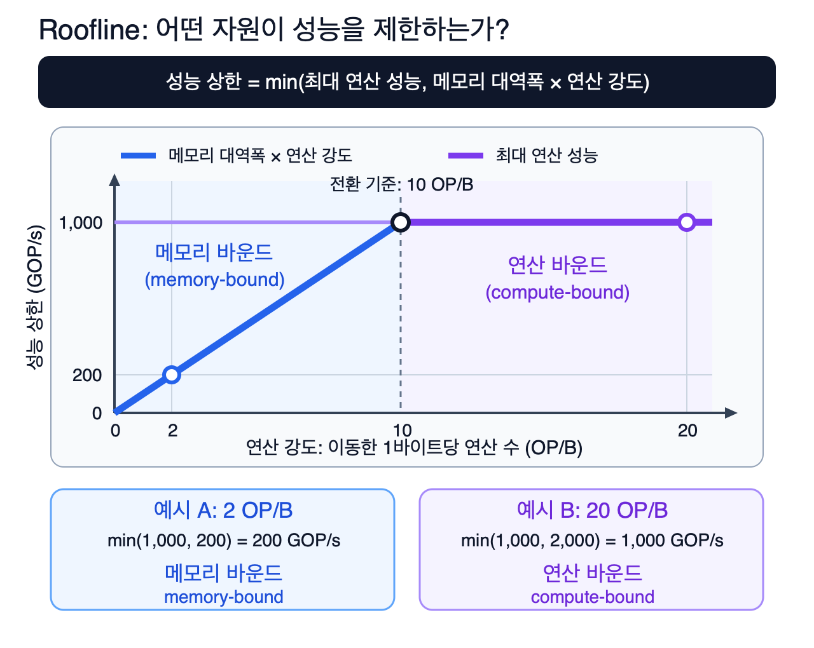
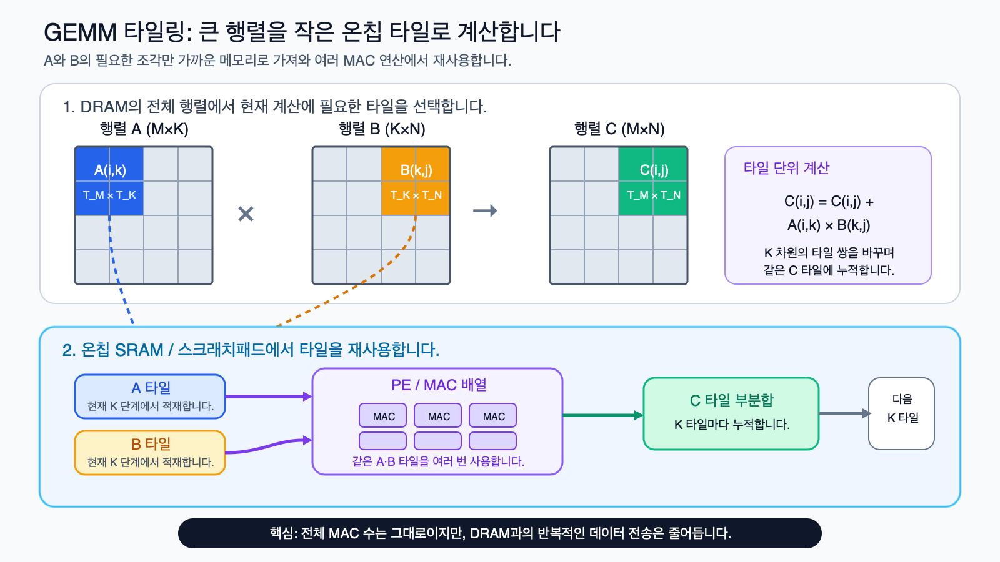
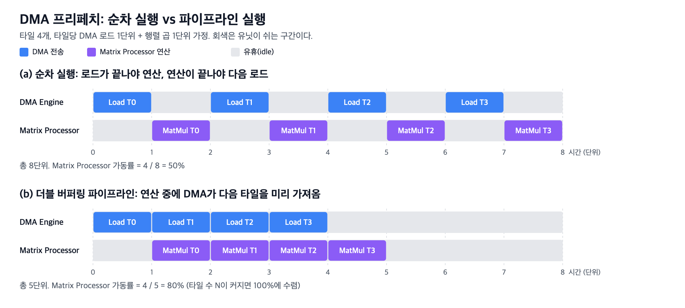
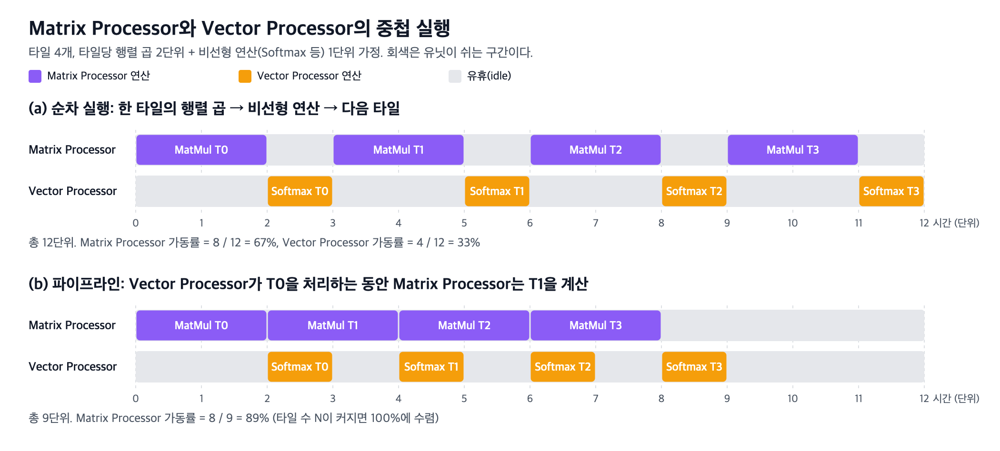
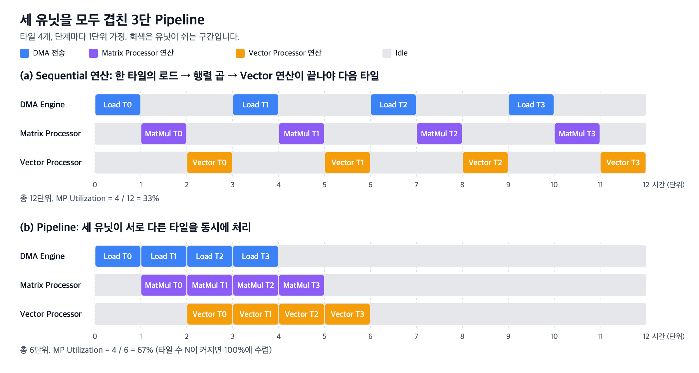

# 03. Model Optimization: NPU 100% 활용하기

> 담당(오너): 김형락, 이영준

[2장](02-npu-hw-architecture-basic.md)에서는 NPU 코어를 구성하는 다섯 블록(Tensor Processor, Vector Processor, DMA Engine, Task Manager, Scratch Pad Memory)을 살펴봤습니다. 이 장에서는 그 하드웨어를 소프트웨어(컴파일러와 런타임)가 어떻게 활용해야 연산기 Utilization을 최대화할 수 있는지 다룹니다. 행렬 곱을 담당하는 Tensor Processor는 이 장에서 역할을 강조해 Matrix Processor로 부르며, 2장의 Scratch Pad Memory는 On-chip SRAM과 같은 의미로 씁니다.

스펙 시트의 Peak TOPS는 "모든 연산기가 매 사이클 유효 연산을 수행한다"는 가정에 기반한 값입니다. 실제 성능은 데이터가 필요한 시점에 도착하는지, 유닛 간 Stall이 발생하지 않는지에 따라 결정됩니다. 이 장은 그 두 가지를 각각 Data Reuse (Tiling)와 Pipeline이라는 소프트웨어 기법으로 설명합니다.

## 1. Peak TOPS ≠ Actual Performance

### Peak TOPS 계산식

스펙 시트의 Peak TOPS(Tera Operations Per Second)는 다음 식으로 계산합니다.

```text
Peak TOPS = MAC 유닛 수 × 2 (곱셈 + 덧셈) × 동작 클럭
```

예를 들어 MAC 유닛 16,384개가 1 GHz로 동작하면 16,384 × 2 × 1 GHz = 32.8 TOPS가 됩니다. 정밀도에 따라 동시에 동작하는 유효 MAC 유닛 수가 달라지므로 INT8과 FP16의 Peak 값은 보통 2배 이상 차이가 납니다. 이 값은 하드웨어가 도달할 수 있는 상한이며, 다음 세 가지를 모두 전제로 합니다.

- **입력 공급**: 모든 MAC 유닛에 매 사이클 유효한 입력이 공급됩니다
- **Stall 없음**: 연산기가 데이터 도착을 대기하는 Stall 사이클이 없습니다
- **Shape Alignment**: 행렬 크기가 연산기 배열 크기의 정수배입니다

### 실제 성능 저하 요인

실제 성능은 `Peak TOPS × Utilization`입니다. Utilization이 떨어지는 대표적인 원인은 다음과 같습니다.

| 원인 | 성격 | 현상 | 대응하는 소프트웨어 기법 |
|---|---|---|---|
| Memory Bound | 대역폭 한계 | Off-chip 대역폭이 연산기 처리량보다 낮아 연산기에 Stall이 발생합니다 | Data Reuse (Tiling) — 3절 |
| Pipeline Stall | Pipeline 처리 실패 | DMA 로드 구간과 Vector Processor 실행 구간에 Matrix Processor가 Stall 상태입니다 | Pipeline — 4절 |
| Padding Overhead | 연산기 배열 낭비 | 128행 배열에 96행 행렬을 매핑하면 32행이 사용되지 않아 Utilization 상한이 75%입니다 | Shape Alignment, Padding 최소화 |
| Latency Bound | 고정 비용 지배 | Kernel Launch Overhead와 유닛 간 동기화, Host↔Device 전송 비용이 전체 실행 시간을 지배합니다 | Operator Fusion, Batch 처리 |

앞의 두 가지가 가장 큰 비중을 차지하므로 이 장에서 집중적으로 다룹니다. 어느 쪽이 병목인지 판단하는 도구가 다음 절의 Roofline Model입니다.

---

## 2. Memory Bound와 Compute Bound: Roofline Model

### Arithmetic Intensity

어떤 연산의 병목이 메모리 대역폭에 있는지 연산기 처리량에 있는지를 판별하는 지표가 Arithmetic Intensity입니다.

- **정의**: Off-chip 메모리와 주고받는 데이터 1 Byte당 수행하는 연산 수
- **메모리 이동량**: 읽기와 쓰기를 모두 더하며, On-chip SRAM 접근은 포함하지 않습니다
- **단위**: FLOP/B, 정수 연산이면 OP/B

```text
Arithmetic Intensity (FLOP/B) = 총 연산 수 (FLOP) ÷ Off-chip 메모리 이동량 (Byte)
```

### Roofline Model

Roofline Model은 하드웨어의 두 가지 상한 중 낮은 쪽이 Achievable Performance를 결정한다는 모델입니다.

```text
Achievable Performance = min( Peak 연산 성능,  메모리 대역폭 × Arithmetic Intensity )
Ridge Point            = Peak 연산 성능 ÷ 메모리 대역폭
```

- **Memory Bound**: Arithmetic Intensity가 Ridge Point보다 낮은 구간
  - **제한 요인**: 메모리 대역폭
  - **특징**: 연산기 처리량을 높여도 성능이 향상되지 않습니다
  - **해법**: Batch와 Tiling으로 데이터를 재사용하거나 양자화로 Byte 수를 줄여 Arithmetic Intensity를 올립니다
- **Compute Bound**: Arithmetic Intensity가 Ridge Point보다 높은 구간
  - **제한 요인**: 연산기 처리량
  - **특징**: 메모리 대역폭을 높여도 성능이 향상되지 않습니다
  - **해법**: 연산기 Utilization을 올립니다

  
*[Figure 1. Roofline Model] Peak 연산 성능 1,000 GOP/s, 메모리 대역폭 100 GB/s인 가상 하드웨어이며 Ridge Point는 10 OP/B입니다. 아래 LLM 예시에 쓰는 하드웨어(100 TFLOP/s, 1 TB/s)와는 다른 가정입니다. Arithmetic Intensity 2 OP/B인 작업은 200 GOP/s로, 20 OP/B인 작업은 1,000 GOP/s로 제한됩니다.*

### 예시: LLM Prefill과 Decode

같은 모델, 같은 하드웨어라도 어떤 단계를 실행하느냐에 따라 Memory Bound인지 Compute Bound인지가 달라집니다. LLM 추론이 대표적인 사례입니다. 가정은 다음과 같습니다.

- **모델**: FP16 7B Dense 모델, 가중치 크기 = 7B × 2 Byte = 14 GB
- **토큰당 연산량**: 행렬 연산량 ≈ 2 × 파라미터 수 = 14 GFLOP/token (Pope et al.)
- **예시 하드웨어**: Peak 100 TFLOP/s, Off-chip 메모리 대역폭 1 TB/s → Ridge Point 100 FLOP/B
- **가중치 로드**: On-chip SRAM 용량을 초과하므로 매 실행마다 Off-chip에서 한 번씩 읽습니다
  - **단순화**: Attention의 KV Cache 이동량은 제외합니다

**Decode (Batch 1)**: 토큰을 한 개씩 Autoregressive 방식으로 생성합니다. 한 단계마다 가중치 14 GB를 전부 읽어서 14 GFLOP만 계산합니다.

```text
Arithmetic Intensity   = 14 GFLOP ÷ 14 GB = 1 FLOP/B          (Ridge Point 100보다 훨씬 낮음 → Memory Bound)
Achievable Performance = min(100 TFLOP/s, 1 TB/s × 1 FLOP/B) = 1 TFLOP/s   (Peak의 1%)
토큰당 Latency 하한    = 14 GB ÷ 1 TB/s = 14 ms                   (가중치를 한 번 읽는 시간)
Decode Throughput 상한 = 1 token ÷ 14 ms ≈ 71 token/s
```

마지막 두 줄이 이 계산의 핵심 결과입니다.

- **Latency 하한**: Memory Bound에서는 연산 시간이 메모리 전송 시간보다 훨씬 짧아 전송 시간이 전체 Latency를 결정하므로, 토큰 하나의 최소 시간은 가중치 14 GB를 1 TB/s로 한 번 읽는 시간인 14 ms입니다
- **Throughput 상한**: Batch 1에서는 한 번에 토큰 하나만 생성되므로 14 ms의 역수인 초당 약 71 토큰이 상한입니다
- **연산기 상태**: 14 GFLOP은 100 TFLOP/s 기준 0.14 ms에 완료되므로, 나머지 시간에는 연산기가 가중치 도착을 대기합니다

**Prefill (입력 1,024 토큰)**: 프롬프트 전체를 한 번에 처리합니다. 동일하게 가중치 14 GB를 한 번 읽지만, 그 가중치로 1,024개 토큰을 계산합니다.

```text
총 연산량              = 14 GFLOP/token × 1,024 token = 14.3 TFLOP
Arithmetic Intensity   = 14.3 TFLOP ÷ 14 GB ≈ 1,024 FLOP/B  (Ridge Point 100보다 높음 → Compute Bound)
Achievable Performance = min(100 TFLOP/s, 1 TB/s × 1,024 FLOP/B) = 100 TFLOP/s   (Peak의 100%)
실행 시간              ≥ 14.3 TFLOP ÷ 100 TFLOP/s = 143 ms   (메모리 시간 14 ms는 연산 시간에 중첩됨)
```

**Decode (Batch Nb)**: 요청 Nb개를 Batch로 처리하면 한 번 읽은 가중치를 Nb개 토큰이 재사용하므로 Arithmetic Intensity가 Nb FLOP/B가 됩니다. Batch 32에서는 32 FLOP/B로 여전히 Memory Bound이지만 Achievable Performance는 32 TFLOP/s로 Batch 1의 32배이고, Batch 100에서 Ridge Point에 도달합니다.

| 단계 | Arithmetic Intensity | 판정 | Achievable Performance | Utilization 상한 |
|---|---:|---|---:|---:|
| Decode, Batch 1 | 1 FLOP/B | Memory Bound | 1 TFLOP/s | 1% |
| Decode, Batch 32 | 32 FLOP/B | Memory Bound | 32 TFLOP/s | 32% |
| Decode, Batch 100 | 100 FLOP/B | Ridge Point | 100 TFLOP/s | 100% |
| Prefill, 1,024 토큰 | 1,024 FLOP/B | Compute Bound | 100 TFLOP/s | 100% |

이 표의 Utilization 상한은 KV Cache 이동량을 제외하고 Shape Alignment를 가정한 메모리 관점의 값입니다. 실제로는 Batch Size가 커질수록 KV Cache 이동량도 함께 늘어나므로 Decode의 Arithmetic Intensity는 Batch Size에 정비례하지 않고 이보다 낮습니다.

여기서 두 가지 최적화 방향이 나옵니다.

- **Memory Bound 구간**: Off-chip 이동 Byte 수를 줄이는 것이 핵심입니다
  - **방법**: Batch Size를 늘려 가중치를 재사용하거나(위 표), 양자화로 가중치 Byte 수를 줄이거나, Tiling으로 같은 데이터의 반복 로드를 제거합니다
  - **다루는 절**: 3절
- **Compute Bound 구간**: 연산기의 Stall 시간을 없애는 것이 핵심입니다
  - **주의**: Arithmetic Intensity가 충분해도 DMA 로드와 연산이 Sequential 연산으로 실행되면 연산기 Utilization은 50%에 그칩니다
  - **다루는 절**: 4절

---

## 3. 예시 1: Data Reuse (Tiling)

### 문제 설정

- **가정**: 행렬 곱 `C[M×N] = A[M×K] × B[K×N]`, M = N = K = 1,024, 데이터 타입 FP16(2 Byte)
- **연산량**: M × N × K = 1,073,741,824 MAC(약 1.07 G MAC, 2.15 GFLOP)이며, 어떤 방식으로 계산하든 변하지 않습니다
- **비교 대상**: 같은 원소를 Off-chip 메모리(DRAM 또는 HBM)에서 읽는 횟수입니다
- **C 쓰기 크기**: Tiling 방식에서는 부분합을 SRAM에 누적하므로 1,024 × 1,024 × 4 Byte = 4 MB로 읽기 이동량에 비해 작습니다
- **C 이동량 생략**: 방식 1과 2에서는 부분합을 DRAM에서 읽고 다시 써야 하므로 C 이동량이 더 크지만, 보수적인 비교를 위해 모든 방식에서 생략합니다

### DRAM Access 횟수 비교

**방식 1: 재사용 없음.** MAC 연산을 할 때마다 필요한 A 원소와 B 원소를 DRAM에서 읽습니다. A[i][k]는 j가 바뀔 때마다 N번, B[k][j]는 i가 바뀔 때마다 M번 다시 읽힙니다.

```text
DRAM 읽기 = A: M×N×K + B: M×N×K = 2 × 1,073,741,824 = 2.15 G 원소 = 4.29 GB
Arithmetic Intensity = 2.15 GFLOP ÷ 4.29 GB = 0.5 FLOP/B
```

**방식 2: A의 한 행만 재사용.** A의 i번째 행(K개 원소)을 SRAM에 상주시키고 B 전체를 Streaming하며 C의 i번째 행을 계산합니다. A는 한 번만 읽지만, B는 C의 행마다(M번) 전체를 다시 읽습니다.

```text
DRAM 읽기 = A: M×K + B: M×N×K = 1.05 M + 1,073.7 M ≈ 1.07 G 원소 = 2.15 GB
Arithmetic Intensity ≈ 1 FLOP/B
```

**방식 3: T×T 출력 Tiling.** C를 T×T 타일로 나누고, 타일 하나를 계산하는 동안 필요한 A 타일(T×Tk)과 B 타일(Tk×T)을 SRAM에 적재해 K 방향으로 Tk씩 부분합을 누적합니다. SRAM에 적재된 A 원소는 T번, B 원소도 T번 재사용된 뒤 해제됩니다. A 전체는 N/T번, B 전체는 M/T번만 읽힙니다.

  
*[Figure 2. GEMM Tiling] A 타일과 B 타일을 SRAM에 적재한 뒤 여러 MAC 연산에서 재사용하고, K 방향의 다음 타일 쌍으로 이동하며 같은 C 타일에 부분합을 누적합니다.*

```text
T = 128:
DRAM 읽기 = A: M×K×(N/T) + B: K×N×(M/T) = 8.4 M + 8.4 M = 16.8 M 원소 = 33.6 MB
Arithmetic Intensity = 2.15 GFLOP ÷ 33.6 MB = 64 FLOP/B

T = 256:
DRAM 읽기 = 4.2 M + 4.2 M = 8.4 M 원소 = 16.8 MB
Arithmetic Intensity = 128 FLOP/B
```

| 방식 | A 읽기 (원소) | B 읽기 (원소) | DRAM 이동량 | Arithmetic Intensity | 방식 1 대비 |
|---|---:|---:|---:|---:|---:|
| 1. 재사용 없음 | 1,073.7 M | 1,073.7 M | 4.29 GB | 0.5 FLOP/B | 1× |
| 2. A 한 행 재사용 | 1.05 M | 1,073.7 M | 2.15 GB | 1 FLOP/B | 2× |
| 3a. 128×128 타일 | 8.4 M | 8.4 M | 33.6 MB | 64 FLOP/B | 128× |
| 3b. 256×256 타일 | 4.2 M | 4.2 M | 16.8 MB | 128 FLOP/B | 256× |

정사각 타일에서 Arithmetic Intensity는 `T / 2` FLOP/B(FP16 기준)로 타일 한 변의 길이에 비례합니다. 일반적으로 Tm × Tn 출력 타일의 Arithmetic Intensity는 `Tm × Tn / (Tm + Tn)`(FP16 기준)이며, 타일이 클수록 한 번 가져온 데이터를 더 많이 재사용합니다.

### 소프트웨어가 하는 일

2장에서 본 대로 NPU는 Cache가 아니라 컴파일러가 관리하는 Scratch Pad Memory를 사용합니다. 따라서 위의 선택은 전부 컴파일 시점에 결정됩니다.

- **타일 크기 결정**: SRAM 용량(Double Buffer 포함)에 들어가는 최대 크기를 선택합니다
  - **Shape Alignment**: 연산기 배열 크기의 배수로 맞춰 Padding Overhead도 함께 줄입니다
- **루프 순서 결정**: 어떤 피연산자를 SRAM에 Stationary로 유지하고 어떤 피연산자를 Streaming으로 공급할지 결정합니다
- **DMA 전송 계획 생성**: 어느 타일을 언제 어디로 옮길지 명령 시퀀스로 만들어 Task Manager에 전달합니다
  - **연결**: 이 시퀀스가 4절 Pipeline의 입력이 됩니다

---

## 4. 예시 2: Pipeline

- **문제**: 3절에서 타일 크기를 늘려 Arithmetic Intensity를 올렸다고 해도 연산기 Utilization이 100%가 되지는 않습니다
- **원인**: 타일 로드와 계산이 Sequential 연산으로 이어지면 연산기는 절반의 시간 동안 Stall 상태입니다
- **이 절의 내용**: 서로 다른 유닛을 중첩 실행하는 두 가지 사례와 이를 결합한 3단 Pipeline을 타임라인으로 보여줍니다
- **시간 단위**: 상대값이며 절대 시간이 아닙니다
- **약어**: 이 절에서는 Matrix Processor를 MP, Vector Processor를 VP로 줄여 씁니다

### DMA Prefetch: 연산 중에 다음 타일을 미리 가져오기

타일 4개를 처리하는 데 타일당 DMA 로드 1단위, MP 연산 1단위가 걸리는 경우를 가정합니다.

  
*[Figure 3. DMA Prefetch 타임라인] (a) Sequential 연산은 로드가 끝나야 연산을 시작하고, 연산이 끝나야 다음 로드를 시작합니다. (b) Double Buffering은 MP가 타일 T0을 계산하는 동안 DMA Engine이 T1을 두 번째 버퍼에 로드합니다.*

이 기법을 Double Buffering이라고 합니다. SRAM에 입력 버퍼를 두 개 할당하고, 연산기가 한 버퍼를 읽는 동안 DMA Engine이 다른 버퍼를 로드합니다. 2장에서 "DMA가 CPU 개입 없이 독립적으로 전송하므로 연산과 데이터 이동을 겹칠 수 있다"고 한 것이 정확히 이 구조입니다.

Double Buffering을 적용할 때 함께 검토할 사항은 두 가지입니다.

- **Load > Compute인 경우**: Pipeline을 적용해도 DMA Engine이 병목입니다
  - **현상**: 연산기가 다음 타일 도착을 대기합니다
  - **의미**: 타일 단위의 Memory Bound입니다
  - **해법**: 3절과 같이 타일 크기를 늘려 Arithmetic Intensity를 올립니다
- **Double Buffering의 비용**: 입력 버퍼를 두 개 할당해야 합니다
  - **SRAM Footprint**: 출력 버퍼는 이중화하지 않으므로 전체 Footprint가 두 배로 늘지는 않습니다
  - **타일 크기**: 입력 타일에 할당할 수 있는 SRAM 용량이 줄어 타일 한 변이 작아지고 Arithmetic Intensity가 떨어질 수 있습니다
  - **컴파일러의 선택**: "큰 타일의 Single Buffer"와 "작은 타일의 Double Buffer" 사이에서 총 실행 시간이 짧은 쪽을 선택합니다

### Matrix Processor와 Vector Processor의 중첩

Transformer 한 층에서는 행렬 곱(MP)과 비선형 연산(VP)이 번갈아 실행됩니다. Attention에서는 `QKᵀ`(MP) → Softmax(VP) → `×V`(MP), FFN에서는 Linear(MP) → GELU(VP) → Linear(MP) 순서입니다. 타일 4개에 대해 타일당 행렬 곱 2단위, Softmax 1단위가 걸리는 경우를 가정합니다. 여기서 T0~T3은 Query 행 블록이며, 각 타일이 `QKᵀ` 한 행 전체를 담고 있다고 가정합니다.

  
*[Figure 4. MP와 VP의 중첩 실행 타임라인] (a) Sequential 연산은 한 타일의 행렬 곱이 끝난 뒤 Softmax를 실행하고, 그동안 MP는 Stall 상태입니다. (b) Pipeline은 VP가 T0의 Softmax를 계산하는 동안 MP가 T1의 행렬 곱을 시작합니다.*

- **중첩이 가능한 이유**: 두 유닛은 서로 다른 하드웨어이므로 동시에 동작할 수 있습니다
  - **제약 조건**: 중첩을 제한하는 것은 데이터 의존성뿐입니다
  - **의존성이 있는 경우**: Softmax T0은 MatMul T0의 결과가 있어야 시작할 수 있습니다
  - **의존성이 없는 경우**: MatMul T1은 Softmax T0에 의존하지 않으므로 대기할 필요가 없습니다
- **의존성이 단순하지 않은 경우**: Softmax는 `QKᵀ` 한 행 전체에 대한 Reduction입니다
  - **문제**: 타일을 Key 방향으로 분할하면 Softmax T0이 T1~T3의 행렬 곱까지 대기해야 하므로 위 Pipeline이 성립하지 않습니다
  - **해법**: 부분 최댓값과 부분합을 누적하며 재보정하는 Online Softmax(FlashAttention 계열)로 의존성을 제거합니다
  - **예외**: 원소별 연산인 FFN의 GELU에는 이러한 제약이 없습니다
- **VP 시간이 MP 시간보다 길어지는 경우**: Batch Size가 작은 Decode에서 나타납니다
  - **원인**: 행렬 곱은 Memory Bound가 되고 M이 작아 연산기 배열을 모두 활용하지 못하는 반면, 원소별 Vector 연산(RMSNorm, Softmax, RoPE 등)은 그만큼 짧아지지 않습니다
  - **결과**: VP가 병목이 됩니다
  - **해법**: 연속된 Vector 연산을 하나로 합치는 Operator Fusion으로 VP 시간 자체를 줄입니다

### 세 유닛을 모두 중첩한 3단 Pipeline

DMA Engine, MP, VP를 모두 중첩하면 각 타일이 세 단계를 거치는 3단 Pipeline이 됩니다. 단계마다 1단위씩 걸린다고 가정한 타임라인은 다음과 같습니다.

  
*[Figure 5. 3단 Pipeline 타임라인] (a) Sequential 연산은 한 타일의 로드, 행렬 곱, Vector 연산이 모두 끝나야 다음 타일을 시작합니다. (b) Pipeline은 DMA Engine이 T1을 로드하는 동안 MP가 T0을 계산하고, 그다음 시간 단위부터는 세 유닛이 서로 다른 타일을 동시에 처리합니다.*

Sequential 연산의 총 시간은 세 단계 시간의 합에 타일 수를 곱한 값이고, Pipeline의 총 시간은 세 단계 중 가장 긴 단계에 타일 수를 곱한 값에 수렴합니다. Utilization을 100%에 가깝게 만들려면 가장 긴 단계가 MP가 되도록 하고, 나머지 두 단계를 그 뒤에 중첩시켜야 합니다.

### 소프트웨어가 하는 일

2장에서 본 대로 NPU는 런타임에 동적으로 스케줄링하지 않습니다. 컴파일러가 실행 순서를 정적으로 결정하고 Task Manager가 그대로 Dispatch합니다. Pipeline은 이 정적 스케줄 안에서 만들어집니다.

- **유닛별 명령 스트림 생성**: DMA Engine, MP, VP 각각에 대해 "언제 무엇을 할지"를 별도 시퀀스로 만듭니다
  - **실행 방식**: 세 시퀀스가 병렬로 실행됩니다
- **의존성 기반 동기화**: 실제 데이터 의존성이 있는 지점(Load T0 완료 → MatMul T0 시작)에만 동기화를 삽입합니다
  - **구현**: Semaphore나 Barrier 같은 Synchronization Primitive를 쓰는 것이 일반적입니다
  - **주의**: 불필요한 동기화 하나가 위 타임라인의 중첩을 Sequential 연산으로 되돌립니다
- **버퍼 할당**: Double Buffer와 MP→VP 사이의 중간 결과 버퍼를 SRAM에 할당합니다
  - **제약**: 이 버퍼들의 SRAM Footprint는 3절의 타일 크기와 Trade-off 관계에 있습니다
- **Operator Fusion**: MP 출력을 DRAM에 내보내지 않고 SRAM에서 바로 VP가 읽도록 연결합니다
  - **효과**: DRAM 왕복이 제거되므로 Arithmetic Intensity가 오르고 VP 시간이 줄어듭니다

---

## 5. 정리: 하드웨어 유닛별로 소프트웨어가 할 일

| 하드웨어 유닛 (2장) | 소프트웨어 기법 (3장) | 하지 않으면 |
|---|---|---|
| Scratch Pad Memory (SRAM) | Tiling으로 한 번 가져온 데이터를 최대한 재사용, Double Buffer와 중간 버퍼 할당 | DRAM 이동량이 수십~수백 배 늘어 Memory Bound가 됨 |
| DMA Engine | 다음 타일 Prefetch(Double Buffering), 컴파일 시점 전송 스케줄 | DMA 로드가 끝날 때까지 연산기가 대기함 |
| Matrix Processor | Shape Alignment로 타일을 배열 크기에 맞춤, Batch로 Arithmetic Intensity 확보 | MAC 유닛이 Padding 값을 연산하거나 데이터 도착을 대기하며 Stall 상태가 됨 |
| Vector Processor | Matrix Processor와 중첩 실행, Operator Fusion | 행렬 곱과 Sequential 연산으로 실행되어 총 시간이 두 단계의 합이 됨 |
| Task Manager | 유닛별 명령 스트림 + 의존성이 있는 지점에만 동기화 | 불필요한 Barrier가 Pipeline을 Sequential 연산으로 되돌림 |

Peak TOPS는 하드웨어가 정한 상한이고, 실제 성능은 소프트웨어가 그 상한에 얼마나 근접하느냐로 결정됩니다. Arithmetic Intensity를 Ridge Point 위로 올리고(Tiling), 가장 긴 단계 뒤에 나머지 단계를 중첩시키면(Pipeline) 그 상한에 근접합니다.

---

## Reference

- [Rebellions Whitepaper](https://rebellions.ai/wp-content/uploads/2026/03/Rebellions_Whitepaper_EN_v.01.pdf)
- [Williams, Waterman, Patterson, *Roofline: An Insightful Visual Performance Model for Multicore Architectures*, CACM 2009](https://escholarship.org/uc/item/78h8v7mr)
- [NVIDIA, GPU Performance Background User's Guide](https://docs.nvidia.com/deeplearning/performance/dl-performance-gpu-background/index.html#understanding-performance)
- [Pope et al., *Efficiently Scaling Transformer Inference*, MLSys 2023](https://arxiv.org/abs/2211.05102)
- [NVIDIA, CUDA C++ Best Practices Guide (Shared Memory in Matrix Multiplication)](https://docs.nvidia.com/cuda/cuda-c-best-practices-guide/index.html#shared-memory-in-matrix-multiplication-c-ab)
- [Sze, Chen, Yang, Emer, *Efficient Processing of Deep Neural Networks: A Tutorial and Survey*, Proc. IEEE 2017](https://arxiv.org/abs/1703.09039)
- [Dao et al., *FlashAttention: Fast and Memory-Efficient Exact Attention with IO-Awareness*, NeurIPS 2022](https://arxiv.org/abs/2205.14135)
