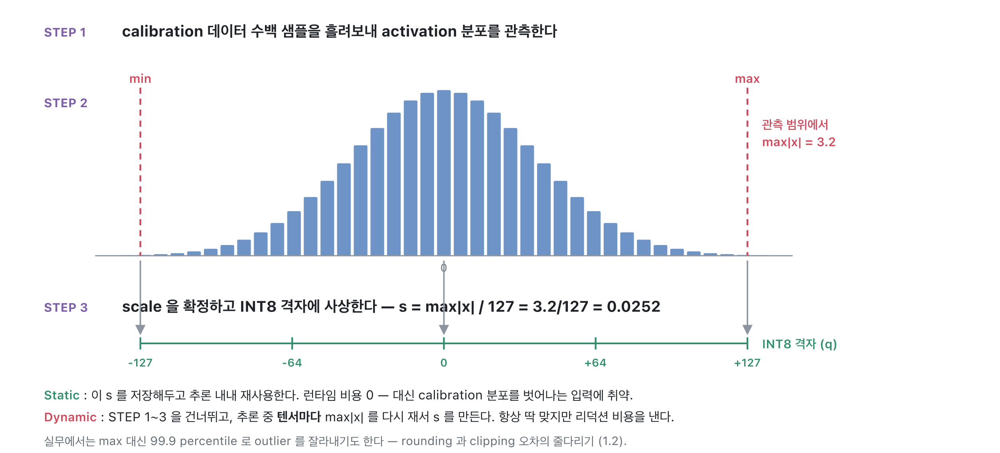
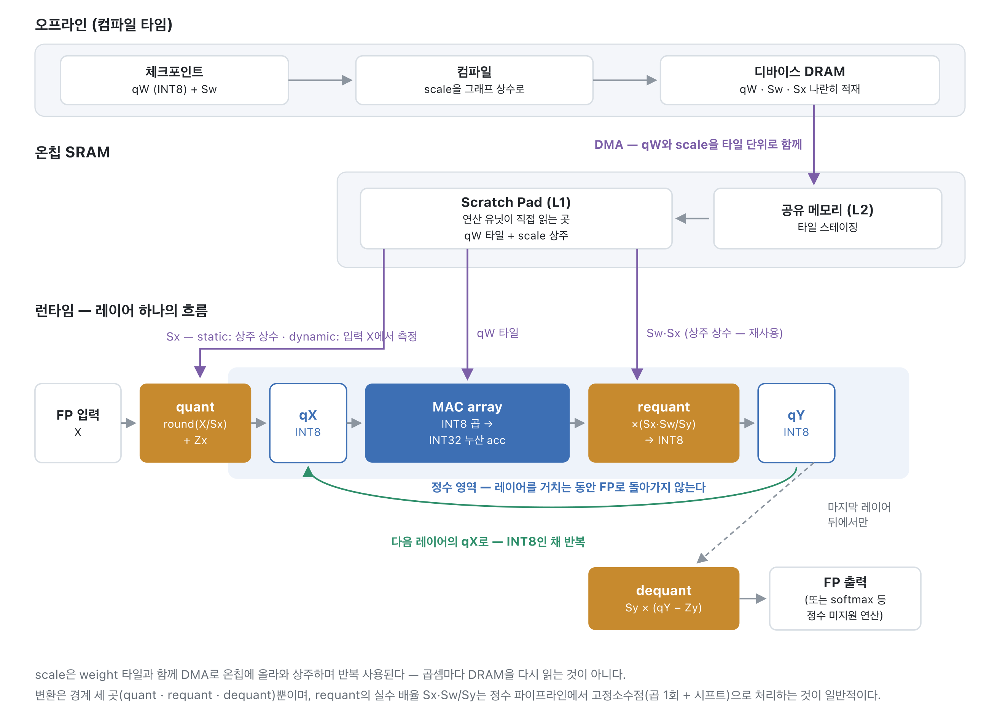
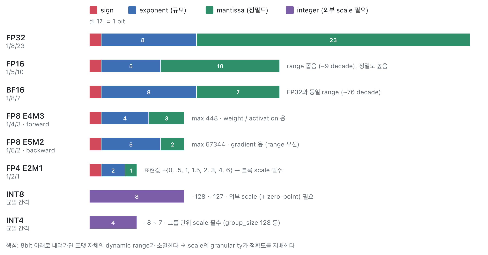
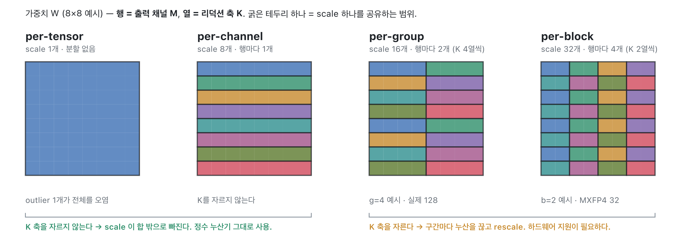
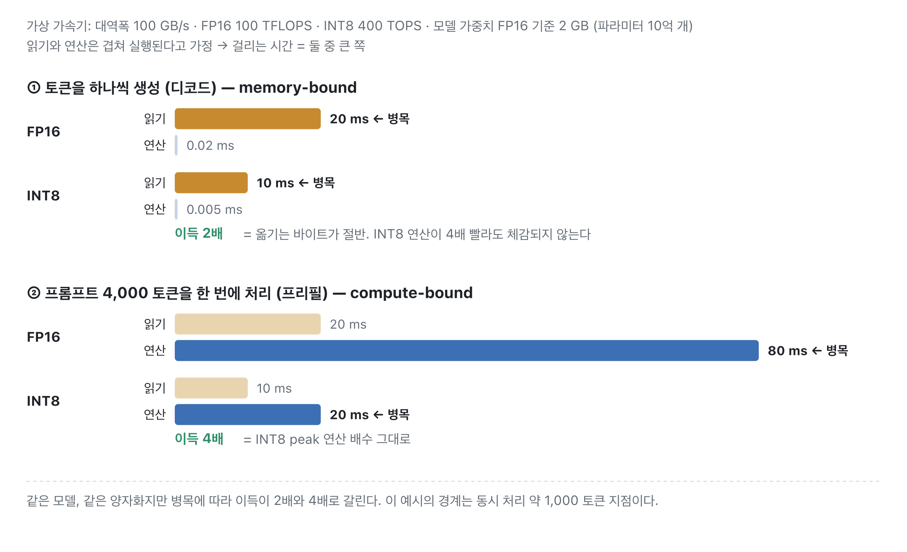

# 04. 저정밀 연산과 양자화

## 개요

이 장은 네 부분으로 구성됩니다. 「1. 양자화 기초」에서는 FP32 실수가 scale과 zero-point를 통해 INT8 정수로 표현되는 원리, 양자화·복원 수식과 오차의 구조, scale을 정하는 calibration, 그리고 정확도를 지키는 두 경로인 PTQ와 QAT를 다룹니다. 「2. NPU 데이터플로우」에서는 양자화된 모델이 실행될 때 scale과 zero-point가 어디에 저장되고, 양자화·복원·재양자화가 어느 지점에서 일어나며, 하드웨어가 대칭 양자화를 선호하는 이유가 무엇인지 봅니다. 「3. 왜 저정밀 연산인가」에서는 정밀도를 낮출수록 모델 크기와 메모리 사용량이 줄고 연산 회로가 작아지는 이유를 회로·에너지 수준에서 확인하고, 그 대가로 생기는 정확도와의 trade-off를 공개 벤치마크로 살펴봅니다. 「4. 양자화가 NPU 성능에 미치는 영향」에서는 이 이득이 실제 NPU에서 DRAM·SRAM 트래픽 감소와 저정밀 MAC 활용이라는 두 경로로 성능이 되는 과정을 봅니다.

읽고 나면 다음 세 가지 관점을 얻게 됩니다. 양자화는 정수 자체가 아니라 scale이 의미를 만드는 손실 압축이라는 것, 저정밀화의 이득은 연산이 싸지는 것보다 옮기는 데이터가 줄어드는 쪽이 본체라는 것, 그리고 연산 성능의 배수는 워크로드의 병목이 연산일 때만 회수된다는 것입니다.

## 1. 양자화 기초 — FP32를 INT8로

### 0.00361238은 0~255 중 어떤 값이 되는가

FP32는 `0.00361238` 같은 실수를 32비트로 표현합니다. 양자화는 이 실수를 0~255(부호 없는 INT8) 같은 좁은 정수 집합의 한 값으로 옮기는 것입니다. 정수는 256개뿐이므로 "어느 실수 구간을 이 256칸에 펼칠 것인가"를 먼저 정해야 합니다.

예를 들어 이 텐서의 값이 `-0.5 ~ +0.5` 범위에 분포한다고 해 봅시다. 전체 폭 1.0을 255칸으로 나누면 한 칸의 크기는 `S = 1/255 ≈ 0.00392157`이고, 실수 0은 정수 `Z = 128`에 대응시킬 수 있습니다. 그러면 다음과 같이 계산됩니다.

```text
q = round(0.00361238 / 0.00392157) + 128 = round(0.9212) + 128 = 129
복원: x^ = 0.00392157 × (129 − 128) = 0.00392157   (오차 약 0.0003)
```

즉 `0.00361238`은 정수 `129`로 저장되고, 되돌리면 `0.00392157`이 됩니다. 여기서 중요한 사실은 정수 129 자체에는 아무 의미가 없다는 것입니다. `S`와 `Z`가 있어야 비로소 실수로서의 의미가 생깁니다.

### scale과 zero-point

- `S` (scale): 정수 한 칸이 실수로 얼마인지를 나타내는 간격입니다. 위 예시에서는 `1/255`입니다.
- `Z` (zero-point): 실수 0이 대응되는 정수 위치입니다. 분포가 한쪽으로 치우쳤을 때 격자를 이동시켜 줍니다.
- `q`: 실제로 저장되고 연산되는 정수 코드입니다.

`Z = 0`으로 두는 특수형을 대칭(symmetric) 양자화라고 부릅니다. 뒤에서 살펴보겠지만 대부분의 NPU에서는 대칭(symmetric) 양자화를 선호합니다. 경우에 따라서는 비대칭(asymmetric) 양자화를 지원하지 않거나, Z를 특정 값(128, 256 ...)으로 제한하기도 합니다.

### 양자화와 복원 수식

일반형은 다음 두 줄이 전부입니다. `clip`은 정수 표현 범위를 벗어난 값을 잘라내는 것입니다.

```text
양자화:  q  = clip( round(x / S) + Z, q_min, q_max )
복원:    x^ = S × (q − Z)
```

복원값 `x^`은 원래 값과 정확히 같지 않습니다. 예를 들어 `x = 1.27`, `S = 0.1`, `Z = 0`이면 `q = round(12.7) = 13`이고, 복원하면 `1.3`이 되어 `0.03`의 오차가 남습니다. 오차는 두 종류입니다. 반올림에서 오는 rounding 오차(최대 `S/2`)와, 범위 밖 값이 잘리는 clipping 오차입니다. `S`를 조이면 clipping이 커지고, 풀면 rounding이 커지는 줄다리기가 양자화 정확도의 핵심입니다.

### scale은 어떻게 정하나 — calibration

가중치(weight)는 모델에 고정되어 있으므로 `S`를 오프라인에서 한 번 계산하면 됩니다. 문제는 입력마다 분포가 바뀌는 활성값(activation)입니다. 대표 입력 수백 개를 모델에 흘려보내 활성값 분포를 관측하고, 그 최소·최대(또는 percentile)에서 `S`를 확정해 저장하는 과정을 calibration이라고 합니다.



calibration으로 정한 `S`를 계속 쓰는 방식이 static 양자화, 추론(inference) 중에 텐서마다 최댓값을 다시 재서 `S`를 만드는 방식이 dynamic 양자화입니다. static은 런타임 비용이 없는 대신 calibration 분포를 벗어나는 입력에 취약하고, dynamic은 항상 딱 맞는 대신 측정 비용을 냅니다.

### 정확도를 지키는 두 경로 — PTQ와 QAT

- PTQ(Post-Training Quantization): 학습 없이 calibration만으로 양자화합니다.
- QAT(Quantization-Aware Training): 학습 그래프에 가짜 양자화(fake quantization)를 끼워 넣고 재학습합니다. `round`의 미분이 거의 모든 곳에서 0이라 기울기가 끊기는데, STE(Straight-Through Estimator)로 미분을 1처럼 통과시켜 FP32 master weight를 계속 갱신합니다. 4비트급의 공격적인 양자화에서 필요해집니다.

두 경로 모두 배포 시점의 정수 연산 구조는 같습니다. 다른 것은 양자화할 weight를 준비하는 과정입니다. PTQ는 학습이 끝난 weight를 그대로 양자화하고, QAT는 FP32 weight를 양자화에 강건해지도록 다시 학습한 뒤 마지막에 정수로 변환합니다.

## 2. NPU 데이터플로우 — 양자화된 모델은 어떻게 실행되는가

### 양자화 파라미터는 어디에 사는가

정수로 변환된 weight `qW`와 그 scale `Sw`는 체크포인트에 나란히 저장되고, 컴파일 시 그래프의 상수가 되어 weight와 함께 디바이스 DRAM에 적재됩니다. static 양자화라면 활성값의 `Sx`도 calibration에서 확정된 상수이므로 커널에 함께 접혀 들어가고, dynamic이라면 런타임에 만들어져 저장 없이 소비됩니다. scale의 크기는 걱정할 수준이 아닙니다. 채널마다 scale을 둬도 수 KB로, 수십 MB인 weight 대비 무시할 수 있는 양입니다. 실행 중에는 DMA가 weight 타일과 scale을 함께 온칩 SRAM(공유 메모리를 거쳐 연산 유닛 옆 scratch pad)에 올려 두고, 타일이 상주하는 동안 반복해서 사용합니다. 곱셈마다 DRAM에서 scale을 다시 읽어 오는 것이 아닙니다.

### quant / dequant / requant는 어디서 일어나는가

레이어 하나의 실행 흐름을 따라가면 변환 지점은 세 곳입니다.



본체 연산은 처음부터 끝까지 정수로 돕니다. 매 레이어 FP로 되돌리는 것이 아니라, INT32 누산값을 다음 레이어의 INT8 격자로 바로 접어 넘기는 것이 요점이고 이 단계를 재양자화(requantization)라고 합니다. 여기서 곱해지는 `Sx·Sw/Sy`는 1보다 작은 실수인데, 정수 전용 파이프라인에서는 이를 고정소수점 근사(정수 곱 1회 + 시프트)로 처리하는 것이 일반적입니다. 덕분에 추론 경로에 부동소수점 유닛이 등장하지 않을 수 있습니다. dequant는 최종 출력을 내보낼 때나 정수로 처리하기 어려운 연산 앞에서만 일어납니다.

### 왜 하드웨어는 symmetric을 선호하는가

zero-point가 살아 있는 채로 곱셈을 전개해 보면 이유가 드러납니다.

```text
(qX − Zx) × (qW − Zw) = qX·qW − Zw·qX − Zx·qW + Zx·Zw
```

- `qX·qW`: 본체입니다. MAC array가 처리합니다.
- `Zx·qW`, `Zx·Zw`: weight와 상수만으로 결정되므로 컴파일 시 미리 계산해 bias에 접어 넣습니다. 런타임 비용이 없습니다.
- `Zw·qX`: 입력에 의존하므로 매 추론마다 `qX`의 합을 따로 구해야 합니다. 이 항이 남는 비용입니다.

`Z = 0`인 대칭 양자화라면 뒤의 세 항이 전부 사라지고 순수한 정수 곱-누산만 남습니다. 하드웨어 입장에서 부가 회로와 부가 연산이 통째로 없어지는 것입니다. 많은 NPU가 대칭 양자화를 선호하고, 비대칭을 아예 지원하지 않거나 `Z`를 고정값으로 제한하기도 하는 이유가 여기에 있습니다.

## 3. 왜 저정밀 연산인가

### 정밀도별 모델 크기



파라미터 하나의 크기가 절반이 되면 모델 전체 크기도 절반이 됩니다. Llama-3-8B(파라미터 약 8.03B) 기준으로 계산하면 다음과 같습니다.

| 정밀도 | 파라미터당 크기 | 가중치 총량 |
|---|---|---|
| FP32 | 4 B | 29.9 GiB |
| FP16 | 2 B | 15.0 GiB |
| INT8 | 1 B | 7.5 GiB |
| INT4 (group 128) | 약 0.53 B | 4.0 GiB |

모델 크기가 줄면 같은 메모리에 더 큰 모델이 올라가고, 같은 시간에 더 많은 파라미터를 읽을 수 있으며, 남는 메모리는 KV 캐시(KV cache)와 batch 확대에 쓰입니다. 즉 용량, 대역폭, 동시 처리량 세 가지가 함께 움직입니다.

### 저정밀 연산은 회로가 싸다

덧셈기는 비트마다 full adder가 하나씩 필요해 비트폭에 대략 비례해 커집니다. 반면 곱셈기는 두 입력의 모든 비트 조합으로 부분곱을 만들기 때문에 n비트 곱셈에 n²개의 부분곱이 필요합니다. 비트폭이 늘수록 곱셈 회로가 덧셈 회로보다 훨씬 빠르게 복잡해집니다.

여기에 부동소수점은 mantissa 곱 외에 지수 정렬, 정규화, 반올림 회로가 더 붙습니다. 특히 누적(MAC) 연산에서는 덧셈이 곱셈보다 훨씬 많이 일어나는데, 정수 누적은 단순한 덧셈인 반면 부동소수점 누적은 매번 지수 비교와 정렬 시프트가 붙어 비용 차이가 커집니다. 45nm 공정 기준 실측 수치로 보면 다음과 같습니다(Horowitz, ISSCC 2014 / Hennessy & Patterson, CAQA 6판 Fig. 1.13).

| 항목 | INT8 | FP32 | 배율 |
|---|---|---|---|
| 덧셈 에너지 | 0.03 pJ | 0.9 pJ | 30배 |
| 곱셈 에너지 | 0.2 pJ | 3.7 pJ | 18.5배 |
| 곱셈기 합성 면적 | 282 μm² | 7,700 μm² | 27배 |

실제 하드웨어 구현 연구도 같은 방향을 보여줍니다. 멀티포맷 FPU인 FPnew를 22nm 공정에 구현한 사례에서는 형식 변환·나눗셈·비교 등 FMA 이외의 기능이 전체 FPU 면적의 약 35%를 차지했고(Mach et al.), FMA 유닛을 FP32에서 FP16으로 낮추는 것만으로 면적이 61.6% 줄어든 합성 결과도 보고되었습니다(Brunie, 28nm). 같은 실리콘 예산이라면 저정밀 연산기를 그만큼 더 많이 넣을 수 있다는 뜻이고, 이것이 NPU들이 INT8·INT4 MAC에 투자하는 이유입니다.

### 하지만 정확도가 떨어질 수 있다

양자화는 정보를 버리는 손실 압축이므로 정확도 하락 가능성이 항상 있습니다. 다행히 공개 벤치마크 기준으로 8비트는 사실상 무손실에 가깝습니다. Hugging Face에 공개된 Llama-3.1-8B-Instruct 양자화 모델의 OpenLLM v1 평균 점수를 보면 다음과 같습니다(RedHatAI 모델 카드 기준).

| 구성 | 기준(FP16) | 양자화 후 | 회복률 | 메모리 절감 |
|---|---|---|---|---|
| W8A8 (INT8) | 74.1 | 74.3 | 100.3% | 약 50% |
| W4A16 (INT4, group 128) | 74.3 | 73.5 | 98.9% | 약 75% |

8비트가 잘 버티는 직관적인 이유는 내적의 통계에 있습니다. 행렬 곱에서 신호는 수천 개 항의 합으로 커지는데, 각 항의 반올림 오차는 부호가 제각각이라 서로 상쇄되며 훨씬 느리게 자랍니다. 레이어가 클수록 오차 비율이 작아지는 셈입니다. 반대로 4비트부터는 표현 칸이 16개뿐이라 오차가 무시하기 어려워지고, 소수의 큰 이상값(outlier)이 scale을 키워 나머지 값을 뭉개는 문제가 커집니다.



이를 완화하는 대표 수단이 scale의 granularity입니다. 텐서 전체에 scale 하나(per-tensor)를 쓰는 대신 채널마다(per-channel), 더 나아가 일정 개수 묶음마다(per-group) scale을 두면 이상값의 영향 범위가 좁아집니다. 위 표의 W4A16이 group 128 단위 scale을 쓰는 것도 이 때문입니다. 결국 저정밀화는 효율과 정확도의 trade-off이며, 몇 비트까지 내릴지는 목표 정확도와 태스크로 결정합니다.

## 4. 양자화가 NPU 성능에 미치는 영향

### 진짜 비용은 데이터 이동

45nm 기준으로 DRAM에서 32비트 하나를 읽는 에너지는 640 pJ로, INT8 곱셈(0.2 pJ)의 3,200배입니다(Horowitz, ISSCC 2014). 연산보다 데이터를 옮기는 쪽이 압도적으로 비싸다는 뜻이고, NPU의 온칩 메모리 계층이 존재하는 이유이기도 합니다. 따라서 양자화의 이득 대부분은 "곱셈이 싸져서"가 아니라 "옮기는 바이트가 줄어서" 옵니다.

### DRAM·SRAM 트래픽 감소

파라미터당 크기가 절반이 되면 DRAM에서 읽어오는 트래픽도 절반이 됩니다. 리벨리온(Rebellions) ATOM(GDDR6 16 GiB, 256 GB/s) 기준으로 보면 효과가 두 단계로 나타납니다.

- 우선 올라가느냐의 문제입니다. Llama-3-8B의 FP16 가중치는 15.0 GiB로 16 GiB 메모리의 94%를 차지해 KV 캐시와 작업 공간이 들어갈 자리가 없습니다. INT8이면 7.5 GiB로 절반이 남습니다. 이 급의 모델에서 양자화는 최적화 이전에 실행 조건입니다.
- 온칩 SRAM 활용도가 올라갑니다. ATOM의 Neural Engine당 Scratch Pad는 4 MB로 고정인데, INT8이면 같은 공간에 FP16의 2배 크기 타일이 들어갑니다. 타일이 커지면 데이터 재사용이 늘고 DRAM을 오가는 DMA 횟수가 줄어듭니다.

### 저정밀 MAC의 이득은 병목이 정한다 — memory-bound와 compute-bound

가속기의 성능 상한은 두 개입니다. 초당 처리할 수 있는 연산 수(peak 연산 성능)와, 초당 메모리에서 가져올 수 있는 바이트 수(메모리 대역폭)입니다. 읽기와 연산이 겹쳐 실행된다고 보면 걸리는 시간은 둘 중 큰 쪽으로 정해지고, 어느 쪽이 먼저 차느냐에 따라 워크로드는 memory-bound와 compute-bound로 나뉩니다. 양자화의 이득도 이 병목을 따라갑니다.

- memory-bound일 때: 시간은 옮길 바이트를 대역폭으로 나눈 값입니다. 이득은 비트를 줄인 만큼(FP16에서 INT8이면 2배)이고, 저정밀 MAC이 아무리 빨라도 그 이상 빨라지지 않습니다.
- compute-bound일 때: 시간은 연산 수를 peak로 나눈 값입니다. 이득은 하드웨어의 저정밀 연산 배수를 그대로 따라갑니다.

가상의 수치로 확인해 봅시다. 대역폭 100 GB/s, FP16 100 TFLOPS, INT8 400 TOPS인 가속기에 FP16 기준 2 GB(파라미터 10억 개) 모델이 올라가 있다고 하겠습니다.



- 토큰을 하나씩 생성하는 디코드(decode)는 토큰마다 가중치 전체를 읽지만 연산은 파라미터당 2회뿐입니다. FP16은 읽기 20 ms에 연산 0.02 ms로 완전한 memory-bound이고, INT8로 바꾸면 읽을 바이트가 절반이 되어 10 ms가 됩니다. 이득은 2배이고, INT8 연산이 4배 빨라도 체감되지 않습니다.
- 프롬프트 4,000 토큰을 한 번에 처리하는 프리필(prefill)은 읽어온 가중치를 4,000개 토큰이 공유하므로 연산이 지배합니다. FP16은 연산 80 ms로 compute-bound이고, INT8이면 20 ms입니다. 이득이 연산 배수 그대로 4배입니다.

같은 모델, 같은 양자화인데 이득이 2배와 4배로 갈립니다. 이 예시에서 경계는 동시에 처리하는 토큰 약 1,000개 지점이며, 그 위치는 대역폭과 peak의 비율이 정합니다. 실제 가속기의 저정밀 peak 배수는 스펙에 공개되어 있으므로, 자신의 워크로드가 어느 병목에 있는지를 먼저 판단해야 기대 이득을 바르게 잡을 수 있습니다.

## 정리

- 양자화는 실수를 `q = round(x/S) + Z`로 정수에 옮기는 손실 압축이며, 정수는 `S`와 `Z`가 있어야 의미를 갖습니다.
- 양자화 파라미터는 컴파일 시 상수로 접히고 본체 연산은 정수로만 돕니다. 레이어 경계의 재양자화가 scale을 처리하며, `Z = 0`(대칭)이면 부가 항이 모두 사라져 하드웨어가 단순해집니다.
- 저정밀로 갈수록 모델 크기와 메모리 트래픽이 줄고 연산 회로가 싸지지만, 정확도와의 trade-off가 있습니다. 공개 벤치마크 기준 8비트는 사실상 무손실(회복률 100.3%), 4비트는 약간의 손실(98.9%)입니다.
- NPU에서 양자화의 이득은 데이터 이동 감소가 본체입니다. DRAM 트래픽과 SRAM 타일 효율이 먼저 좋아지고, INT8/INT4 MAC의 연산 배수는 연산이 병목인 구간(프리필·대배치)에서 회수됩니다.

## 참고

- Mark Horowitz, "Computing's Energy Problem (and what we can do about it)", ISSCC 2014 — 연산·메모리 접근 에너지
- John Hennessy & David Patterson, Computer Architecture: A Quantitative Approach 6e, Fig. 1.13 — 연산 회로 합성 면적
- Stefan Mach et al., "FPnew: An Open-Source Multiformat Floating-Point Unit Architecture", IEEE TVLSI 2020 — 멀티포맷 FPU 면적 분해
- Nicolas Brunie, "Modified Fused Multiply and Add for Exact Low Precision Product Accumulation", ARITH 2017 — 저정밀 FMA 합성 면적
- Benoit Jacob et al., "Quantization and Training of Neural Networks for Efficient Integer-Arithmetic-Only Inference", CVPR 2018 — 양자화 수식과 정수 추론
- RedHatAI, Meta-Llama-3.1-8B-Instruct-quantized.w8a8 / w4a16 모델 카드 (Hugging Face) — 양자화 벤치마크
- Rebellions, ATOM 아키텍처 백서 및 제품 브리프 — ATOM 스펙
- 원 발표 자료: 민지호 「NPU와 양자화」, 박태형 「저정밀 연산과 양자화」 (Hello NPU 세미나, 2026-08)
